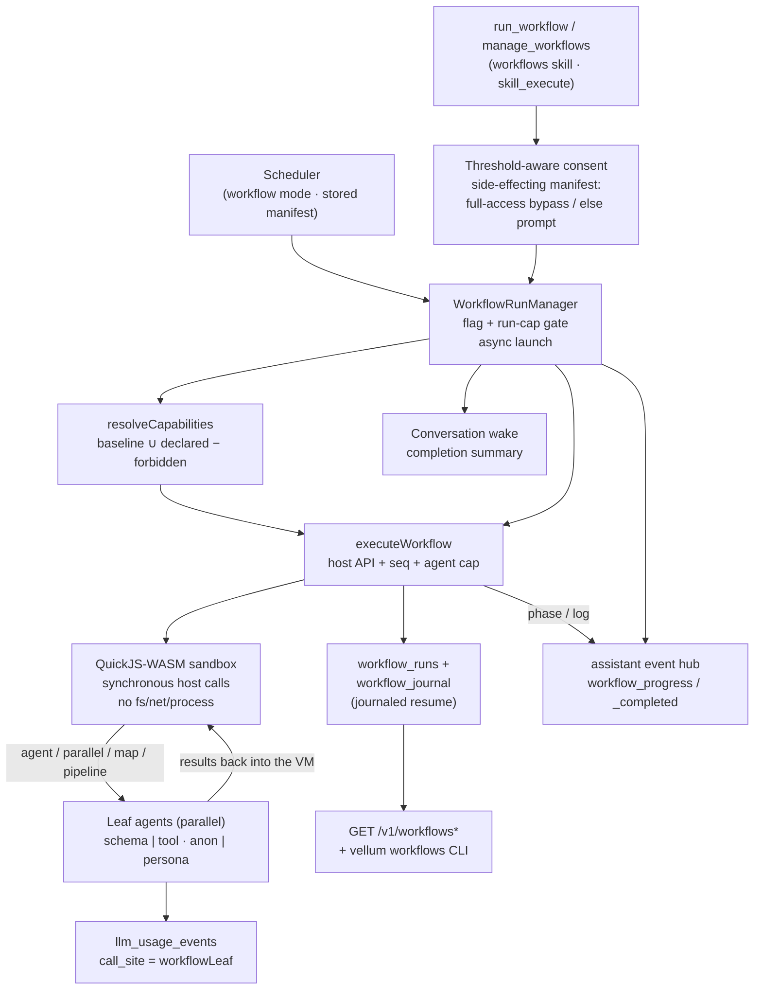
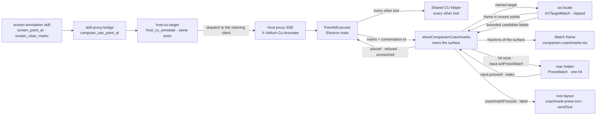
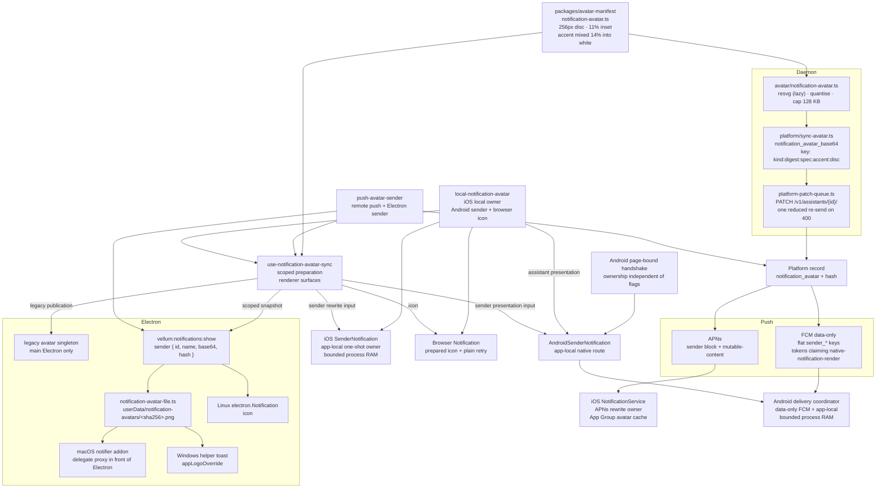
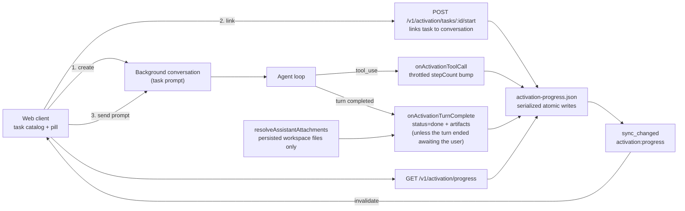

# Vellum Assistant — Architecture

This file is the cross-system architecture index. Detailed designs live in domain docs close to code ownership.

## Architecture Docs

| Domain                                      | Architecture Doc                                                                                   |
| ------------------------------------------- | -------------------------------------------------------------------------------------------------- |
| Assistant runtime                           | [`assistant/ARCHITECTURE.md`](assistant/ARCHITECTURE.md)                                           |
| Gateway ingress/webhooks                    | [`gateway/ARCHITECTURE.md`](gateway/ARCHITECTURE.md)                                               |
| Browser extension                           | [`clients/chrome-extension/README.md`](clients/chrome-extension/README.md)                         |
| Clients (web, iOS, Android, macOS, Windows) | [`clients/README.md`](clients/README.md)                                                           |
| Mobile document chat session | [`clients/web/docs/DOCUMENT_CHAT.md`](clients/web/docs/DOCUMENT_CHAT.md) |
| Public docs site (`clients/docs`)           | [`clients/docs/README.md`](clients/docs/README.md)                                                 |
| Assistant memory deep dive                  | [`assistant/docs/architecture/memory.md`](assistant/docs/architecture/memory.md)                   |
| Assistant integrations deep dive            | [`assistant/docs/architecture/integrations.md`](assistant/docs/architecture/integrations.md)       |
| Assistant scheduling deep dive              | [`assistant/docs/architecture/scheduling.md`](assistant/docs/architecture/scheduling.md)           |
| Assistant security deep dive                | [`assistant/docs/architecture/security.md`](assistant/docs/architecture/security.md)               |
| Trusted contact access design               | [`assistant/docs/trusted-contact-access.md`](assistant/docs/trusted-contact-access.md)             |
| Trusted contacts operator runbook           | [`assistant/docs/runbook-trusted-contacts.md`](assistant/docs/runbook-trusted-contacts.md)         |
| Credential Execution Service (CES)          | [`assistant/docs/credential-execution-service.md`](assistant/docs/credential-execution-service.md) |
| Environment and data layout                 | [Environment and Data Layout](#environment-and-data-layout) (this file)                            |
| Multi-local instance isolation              | [Multi-Local Instance Isolation](#multi-local-instance-isolation) (this file)                      |
| Docker volume architecture                  | [Docker Volume Architecture](#docker-volume-architecture) (this file)                              |
| Web search failure normalization            | [Web Search Failure Normalization](#web-search-failure-normalization) (this file)                  |
| Workflow orchestration engine               | [Workflow Orchestration Engine](#workflow-orchestration-engine) (this file)                        |
| Watch sessions                              | [Watch Sessions](#watch-sessions) (this file)                                                      |
| Screen annotation                           | [Screen Annotation](#screen-annotation) (this file)                                                |
| Notification sender avatars                 | [Notification Sender Avatars](#notification-sender-avatars) (this file)                            |
| Workflow authoring guide                    | [`assistant/docs/workflows.md`](assistant/docs/workflows.md)                                       |
| Workflow manual testing runbook             | [`assistant/docs/workflows-testing.md`](assistant/docs/workflows-testing.md)                       |
| Service communication matrix                | [`docs/service-communication-matrix.md`](docs/service-communication-matrix.md)                     |
| Vellum Doctor                               | [`assistant/docs/vellum-doctor.md`](assistant/docs/vellum-doctor.md)                               |

## Cross-Cutting Invariants

The optional [Vercel/Daytona demo control service](examples/vercel-daytona/README.md)
routes a shared Telegram bot to private, per-user Vellum gateways. It owns the
demo identity gate, a PostgreSQL delivery inbox, sandbox provisioning, and OAuth
callback routing. Each sandbox keeps its own assistant state and credentials.
The optional `/connect outlook` flow registers Microsoft credentials through the
tenant gateway and uses the shared state-bound callback router. Microsoft tokens
remain in the sandbox credential store; Google connections are independent.
Conversational Outlook setup uses a managed skill and a tenant-bound credential
that can only mint expiring connection links through `/integrations/connect`.
The model chooses when to offer a link; the router validates identity and provider.
WhatsApp ingress verifies Meta signatures and stores encrypted jobs in the same
durable queue. Verified owner email selects the canonical assistant after
same-channel confirmation; pending channel records become aliases to that owner.
WhatsApp text messages reach the private sandbox gateway and replies use Meta's API.
Its optional Telegram Mini App validates signed launch identity and polls a
private, expiring session to approve Google sign-in without a chat confirmation.
The external Google callback records a result; only the bound Mini App session
can approve provisioning. Legacy Telegram confirmation links remain supported.
This example is separate from the platform-owned managed-gateway service.

- Public ingress is gateway-only; external webhook/API routes are implemented in `gateway/` and forwarded internally.
- Bundled-skill outbound API calls that require credentials use the Credential Execution Service (CES) tools (`make_authenticated_request`, `run_authenticated_command`) rather than manual token plumbing or proxied shell execution. See `assistant/docs/credential-execution-service.md`.
- Managed shared-identity channel routing runs in a separate managed-gateway service lane from the per-assistant `gateway/` lane. The deployable managed-gateway runtime is platform-owned; this repo keeps public contracts/fixtures under `gateway-managed/`.
- Production LLM calls go through the provider abstraction, not provider SDKs in feature code.
- The macOS and Windows Electron shells share platform-neutral window security, IPC validation, origin checks, and preload capability registration through `@vellumai/electron-desktop`, plus native helper process and JSON-RPC lifecycle through `@vellumai/native-sidecar`. Each client keeps platform lifecycle and native features in its own adapter modules under `clients/<platform>/src/`. Both preloads implement the same `VellumBridge` contract (`packages/ipc-contract`); a surface only one shell can back is optional there and documented in [`clients/windows/docs/parity-matrix.md`](clients/windows/docs/parity-matrix.md), which `clients/windows/src/preload/bridge-parity.test.ts` enforces against the macOS preload.
- Packaged Windows startup provisions a user-scoped CLI runtime from
  `resources/cli-runtime`. Versioned installs and one fallback live under
  Electron `userData`; a small channel-scoped launcher under
  `%LOCALAPPDATA%\Vellum*\bin` delegates to the selected runtime. Long-lived
  service executables stay in the versioned runtime, and the user PATH
  registry change is broadcast to the Windows shell. See
  [`clients/windows/README.md`](clients/windows/README.md#packaged-cli-provisioning).
- Notification producers emit through `emitNotificationSignal()` to preserve decisioning and audit invariants. Reminder routing metadata (`routingIntent`, `routingHints`) flows through the signal and is enforced post-decision to control multi-channel fanout. The decision engine produces per-channel conversation actions (`start_new` / `reuse_existing`) validated against a candidate set; `notification_conversation_created` is emitted only on actual creation, not on reuse.
- Memory extraction/recall must enforce actor-role provenance gates for untrusted actors.
- Credential health alerts revalidate the exact account after notification composition and before each channel adapter send through the producer's `isStillCurrent` callback. Changed evidence suppresses unsent channels; the dedupe claim is released only when no delivery has succeeded or remains in flight. A failed recheck fails closed. Telegram rechecks the same guard before every text-chunk attempt, including retries; other adapters need their own retry-time validation.
- **Credential Execution Service (CES)** is a separate top-level package (`credential-executor/`) and a separate managed container image that enforces hard process-boundary isolation for credential-bearing operations. The assistant communicates with CES exclusively via RPC (stdio JSON-RPC locally, Unix socket in managed). In Docker mode, the assistant and gateway also access credential CRUD operations via the CES HTTP API (`CES_CREDENTIAL_URL`), authenticated with `CES_SERVICE_TOKEN`. CES exposes three tools (`run_authenticated_command`, `make_authenticated_request`, `manage_secure_command_tool`) as a deliberate exception to the skill-first tool direction — these require hard isolation that skills cannot provide. Shared contract types, credential-storage abstractions, egress-proxy session management, and typed service clients live in seven private packages under `packages/` — these are the only allowed shared-code path; direct source imports between `assistant/` and `credential-executor/` remain banned:
  - `@vellumai/service-contracts` — CES wire-protocol schemas (RPC methods, handshake types, Zod validators) and shared trust-rule types. Consumed via explicit domain subpaths: `@vellumai/service-contracts/credential-rpc`, `@vellumai/service-contracts/trust-rules`, `@vellumai/service-contracts/handles`, `@vellumai/service-contracts/grants`, `@vellumai/service-contracts/rpc`, `@vellumai/service-contracts/rendering`, `@vellumai/service-contracts/error`.
  - `@vellumai/credential-storage` — Credential-storage abstractions shared by assistant and CES.
  - `@vellumai/egress-proxy` — Egress-proxy session management for CES secure commands.
  - `@vellumai/gateway-client` — Typed HTTP client for assistant-to-gateway calls (trust API, feature flags, log export, deliver).
  - `@vellumai/assistant-client` — Typed HTTP client for gateway-to-assistant calls (runtime proxy, export).
  - `@vellumai/ces-client` — Typed HTTP and RPC client for assistant/gateway-to-CES calls (credential CRUD, log export, RPC handshake/envelope). Sub-module exports: `@vellumai/ces-client/http-credentials`, `@vellumai/ces-client/http-log-export`, `@vellumai/ces-client/rpc-client`.

  Secure commands are manifest-driven: each bundle declares an auth adapter (`env_var`, `temp_file`, or `credential_process`), an egress mode (`proxy_required` or `no_network`), and allowed argv patterns; generic HTTP clients, interpreters, and shell trampolines are structurally denied as entrypoints. CES-owned durable state (grants and audit logs) is never read or written by the assistant directly. Credential key files (`keys.enc`, `store.key`) are stored on the CES security volume (`/ces-security`) in Docker mode — no other container has access to this volume. `host_bash` is outside the strong CES secrecy guarantee. Response/output filtering (header stripping, body clamping, secret scrubbing) is defense-in-depth, not the primary protection. Managed rollout requires a third runtime image alongside the assistant and gateway images, with corresponding `vembda` pod-template changes; rollout is gated by five feature flags (`ces-tools`, `ces-shell-lockdown`, `ces-secure-install`, `ces-grant-audit`, `ces-managed-sidecar`; keys are simple kebab-case, e.g. `ces-tools`), all defaulting to off. See [`assistant/docs/credential-execution-service.md`](assistant/docs/credential-execution-service.md).

- Trusted contact ingress ACL is channel-agnostic; identity binding adapts per channel (chat ID, E.164 phone, external user ID) without channel-specific branching.
- macOS managed sign-in connects the desktop app to a platform-hosted assistant via Django assistant-scoped proxy endpoints (`/v1/assistants/{id}/...`). The `HTTPDaemonClient` operates in `platformAssistantProxy` route mode with `X-Session-Token` auth. Managed lockfile entries have `cloud: "vellum"`. Startup guardrails skip local daemon hatching and actor credential bootstrap.
- The macOS host-proxy bridge connects to local loopback assistants and Vellum-managed assistants. Paired lockfile entries retain their desktop data-plane routing, but the app does not open `/v1/events` or result-posting connections that expose the Mac's host tools to paired assistants.
- **Assistant feature flags** control skill availability at runtime. The canonical key format is simple kebab-case (e.g., `browser`, `ces-tools`); the legacy `feature_flags.<id>.enabled` and `skills.<id>.enabled` formats are no longer supported. All declared flags live in the unified registry at `meta/feature-flags/feature-flag-registry.json`, scoped by `scope` (`assistant` or `client`). Labels come from the registry. Bundled copies exist at `assistant/src/config/feature-flag-registry.json` and `gateway/src/feature-flag-registry.json`. The gateway owns the `/v1/feature-flags` REST API and the IPC `get_feature_flags` method (see [`gateway/ARCHITECTURE.md`](gateway/ARCHITECTURE.md)); the assistant resolves effective flag state via IPC to the gateway socket (`gateway.sock`) — see [`assistant/ARCHITECTURE.md`](assistant/ARCHITECTURE.md). When a flag is OFF, the corresponding skill is excluded from all exposure surfaces: client skill lists, system prompt catalog, `skill_load`, runtime tool projection, and included child skills. Guard tests enforce that all flag keys in code use the canonical format and that all referenced flags are declared in the unified registry.
- **Safe storage limits** protect the workspace volume. When workspace disk usage reaches the critical 95% threshold, the assistant enters storage cleanup mode: background work is skipped, remote ingress including trusted-contact messages is blocked, local guardian turns get cleanup-specific runtime instructions, and clients must show acknowledgement/status UI until enough space is freed or the guardian explicitly overrides the lock. See [Safe Storage Limits](#safe-storage-limits).
- **Permission controls v2** removes deterministic tool-by-tool approval friction for assistant-owned actions. Under `permission-controls-v2`, the only built-in deterministic approval surface is conversation-scoped host computer access for `host_*` / host-target tools. All other assistant-owned tool usage relies on model-mediated consent, not temporary approvals, wildcard scopes, per-tool persistence, or network/side-effect approval cards. Cross-principal identity checks (for example unknown actors) still fail closed deterministically.
- **Workflow orchestration**: the assistant authors JS/TS scripts that run in a QuickJS-WASM sandbox and fan out to parallel ephemeral leaf agents. Scripts get **hooks only** — no filesystem, network, process, or ambient capabilities — because a script may be authored after the assistant has read untrusted content. The per-run **capability declaration is the single consent point** (no per-call approval prompts inside a run), and the only runaway guard is the per-run **agent cap** (`maxAgentsPerRun`, default 500) — there is no dollar kill-switch by design. Scripts must be deterministic (no `Date.now`/`Math.random`/argless `new Date()`) so a journaled run can resume after a restart by replaying the unchanged call prefix. See [Workflow Orchestration Engine](#workflow-orchestration-engine) and [`assistant/docs/workflows.md`](assistant/docs/workflows.md).
- **Context overflow resilience**: The session loop implements a deterministic overflow convergence pipeline that recovers from context-too-large failures without surfacing errors to users. A preflight budget check catches overflow before provider calls; a tiered reducer (forced compaction, tool-result truncation, media stubbing, injection downgrade) iteratively shrinks the payload; and when all tiers are exhausted the overflow policy resolver auto-compresses the latest turn with no user prompt — this applies equally to interactive and non-interactive sessions. Setting `contextWindow.overflowRecovery.interactiveLatestTurnCompression` to `"drop"` opts interactive sessions out, and `contextWindow.overflowRecovery.nonInteractiveLatestTurnCompression: "drop"` opts non-interactive/background sessions out independently — either short-circuits to a graceful failure for that session type; setting `contextWindow.overflowRecovery.enabled: false` also yields a graceful failure. Config lives under `contextWindow.overflowRecovery`. See [`assistant/ARCHITECTURE.md`](assistant/ARCHITECTURE.md#context-overflow-recovery) for the full design and [`assistant/docs/architecture/memory.md`](assistant/docs/architecture/memory.md#context-compaction-and-overflow-recovery-interaction) for compaction interaction details.
- **Embedding-dimension reconciliation**: The embedding dimension is a committed property of the Qdrant collection, derived from the backend that built it. At daemon startup `reconcileEmbeddingIdentity` probes the configured backend and reconciles the committed dimension confirm-before-destroy: backend down → defer (recall degrades to empty results, surfaced via `memory_worker_status`'s `embedding.degraded`); no committed dimension → commit the probed dimension and create the collections; match → no-op; mismatch with an explicit provider → migrate (recreate, the only destructive path, gated on a successful probe); mismatch under `auto` → no-op (no thrash on transient backend availability). Platform intent is a fill-only deployment default (`IS_PLATFORM` → `provider: "gemini"`, in-memory, not persisted) — there is no on-disk provider/dimension migration. See [`assistant/docs/architecture/memory.md`](assistant/docs/architecture/memory.md#embedding-dimension-reconciliation).

## Environment and Data Layout

Environments are **namespaces**, not containers. `VELLUM_ENVIRONMENT` selects a path prefix (`vellum` for `production`, `vellum-<env>` for the non-production seeds `dev`, `staging`, `test`, `local`). It does not own data. Data directories are always per-assistant, and the lockfile's `resources.instanceDir` field is the source of truth for any given assistant's on-disk location.

### Per-assistant data directories

Every local assistant's daemon root is `<resources.instanceDir>/.vellum/`. The CLI passes per-instance paths to spawned daemons and gateways via explicit environment variables: `VELLUM_WORKSPACE_DIR` (workspace data), `GATEWAY_SECURITY_DIR` (gateway security state), and `CREDENTIAL_SECURITY_DIR` (CES key stores). `assistant/src/util/platform.ts:vellumRoot` resolves the root from `VELLUM_WORKSPACE_DIR` when set, falling back to `join(homedir(), ".vellum")`. All root-level state (PID file, `.env`, `runtime-port`, `protected/` with its encrypted keys, trust rules, credentials, capability token, etc.) and the workspace directory derive from these helpers.

Allocation of `instanceDir` for new hatches:

| Environment                     | `instanceDir` path                               |
| ------------------------------- | ------------------------------------------------ |
| `production`                    | `$XDG_DATA_HOME/vellum/assistants/<name>/`       |
| non-production (`vellum-<env>`) | `$XDG_DATA_HOME/vellum-<env>/assistants/<name>/` |

There is no "first local" special case — every new hatch goes through the same allocator (`cli/src/lib/assistant-config.ts:allocateLocalResources`) and lands under the XDG multi-instance tree. `~/.vellum/` is never an allocation target; it is only reached via existing lockfile entries whose `instanceDir = homedir()` was recorded before this change.

### Lockfile

| Environment    | Canonical path                                | Read fallback                             |
| -------------- | --------------------------------------------- | ----------------------------------------- |
| `production`   | `~/.vellum.lock.json`                         | `~/.vellum.lockfile.json` (legacy rename) |
| non-production | `$XDG_CONFIG_HOME/vellum-<env>/lockfile.json` | (none — new path)                         |

The CLI routes all lockfile reads/writes through `cli/src/lib/environments/paths.ts:getLockfilePath` / `getLockfilePaths` so non-production environments land in the env-scoped XDG config tree. The parent directory is created on first write.

### Config directory (XDG-shared auth state)

| Environment    | Config dir                       |
| -------------- | -------------------------------- |
| `production`   | `$XDG_CONFIG_HOME/vellum/`       |
| non-production | `$XDG_CONFIG_HOME/vellum-<env>/` |

Platform tokens (`platform-token`), device IDs (`device-id`), and guardian tokens (`assistants/<id>/guardian-token.json`) live under the env-scoped config dir. The CLI (`cli/src/lib/platform-client.ts`, `cli/src/lib/guardian-token.ts`), the daemon (`assistant/src/util/platform.ts:getXdgPlatformTokenPath`, `getXdgVellumConfigDirName`), and the Electron app (`clients/macos/src/main/device-id.ts`) all agree on the same env-scoped path, so `vellum login`, guardian leasing, persisted device IDs, and desktop session state never bleed between environments.

Paired guardian credentials stay in the trusted host. The renderer sends paired traffic to `/assistant/__gateway-paired/<assistantId>/*` without a bearer. The Electron main process, CLI web host, or Vite development host resolves the paired entry, removes any renderer-provided `Authorization` header, reads or refreshes the guardian token, and injects it only on the remote gateway hop. Renderer-facing guardian-token endpoints reject paired assistant IDs. Packaged Electron gates the custom-protocol route through main-process `WebRequest` frame identity because Chromium omits Origin, Referer, and Fetch Metadata from the `GlobalRequest` delivered to custom protocol handlers.

### Device pairing

Connecting a second machine, a phone, or a tablet to a self-hosted assistant runs on one secret: the device code of a challenge minted on the assistant's gateway. Which side mints the challenge sets the direction. The host mints and approves in one step and hands over a pairing link carrying the code, or the joining device mints for itself and shows a short approval code for the host to approve afterward. Every QR code in the flow renders one of those two, never a credential of its own. The user-facing walkthrough is [`docs/self-hosted-phone.md`](docs/self-hosted-phone.md).

**The pairing link** is the forward direction. `vellum pair` and the desktop **Settings → General → Pair a device** card both mint a remote-web challenge on the assistant's own gateway over loopback and approve it on the spot, because running either one on the host machine _is_ the proof of local presence. `buildRemoteWebPairingUrl` composes the result as `<publicBaseUrl>/assistant/pair#device_code=<code>`, carrying the code in the fragment so it never reaches the wire. By default the QR code is that same link rendered as pixels: scanning it, opening it in a browser, and pasting it into `vellum connect import` are three ways to spend one link. `vellum pair --app` changes what the QR encodes, not what pairing does: `buildAppConnectUrl` composes `<scheme>://connect?url=<base>&code=<device code>` (default scheme `vellum-assistant`) so a scan opens the native app on that same device code, and the command prints the app link plus the https link for a device without the app.

**The approval code** is the reverse direction, for starting at the joining device and getting to the host afterward. Handed a bare `https://host` address instead of a link, the importing device mints its own challenge, displays the short `ABCD-EFGH` user code, and polls. The host approves it with `vellum pair --web-approve <code>` or from the pending-requests list on the Pair a device card. `POST /v1/remote-web/pairing-verification` and the three `/v1/remote-web/pairing-requests` routes are loopback-gated, so approving means being on the host.

`resolvePublicBaseUrl` (`packages/service-contracts/src/remote-web-pairing.ts`) is the validator every surface ends up in, and so the place to change what pairing accepts. It normalizes an address to its base, collapsing a pasted pair-page URL back to the host it names, and refuses loopback, private-network IP literals, plain http, and tunnel-vendor websites. `vellum pair` and the Pair a device card call it directly on the URL they are about to advertise. The importing flow calls `parsePairingAddress`, which wraps it and adds the device code read off the link, so one pasted value can be either a pairing link or a bare address. Hosts POST to whatever address they are handed, so those refusals are the SSRF containment for the whole flow.

The exchange runs in the trusted host, never the renderer. `pairingStart` / `pairingPoll` / `pairingCancel` (`packages/local-mode/src/pair.ts`) hold the device code, the client-generated device id, and the challenge TTL in an in-memory map keyed by an opaque handle, handing callers only `{ handle, userCode, expiresAt, intervalSeconds }`. The opaque handle is what keeps the device code off whatever IPC or loopback boundary a host exposes a session over. `vellum connect import` (`cli/src/commands/connect/import.ts`) drives them in-process; the Electron main process exposes them over IPC as `vellum:localMode:pairing*` (`packages/electron-desktop/src/local-mode.ts`), and the CLI web host (`cli/src/commands/client.ts`) and the Vite development host (`clients/web/vite-plugin-local-mode.ts`) each mirror the same three as loopback `__local/pairing-*` routes, so the renderer never sees more than the handle.

`POST /v1/remote-web/pairing-token` branches on `deviceId`. A browser omits it and receives its refresh token as an `HttpOnly` cookie scoped to the refresh path. A host that sends one receives a device-bound, per-device revocable credential whose `refreshToken` comes back in the response body with no `Set-Cookie`, which is what lets a lockfile writer persist it; the `platform` it declares (`cli`, `desktop`, `ios`, or `android`) is what the host's paired-devices list renders. The response branches on that same device-bound decision, never on whether a cookie path was computed, so a browser exchange cannot quietly start serializing its refresh token into the body if the cookie-path helper ever changes. A gateway predating the branch ignores the unknown field and returns no body refresh token, so the pairing registers access-only and warns that it will expire.

The `deviceId` branch is a considered trade-off rather than a free one. It grants no new _scope_: an approved device code already buys a full guardian-scoped session either way. What it changes is how durable and how exfiltratable the credential is. Before it, the strongest thing a party holding an approved code could read out of the response was the 30-day access token, because the refresh credential was reachable only as an `HttpOnly; Secure; SameSite=Strict` cookie that page script cannot read. With it, that same party can add any `deviceId` and read a rotating refresh token good for up to 365 days, or 90 days idle, straight out of the body. That lands on the pair page specifically, because the device code rides in the URL fragment where script on the assistant's remote-web origin can read it: an XSS or a hostile extension there can mint its own device-bound pair instead of being confined to the cookie path.

Four compensating controls bound it, and each is load-bearing. The device code is single-use and expires in ten minutes, so a stolen exchange spends the code and the real device's exchange then fails, which surfaces the theft. `rotateCredentials` compares the caller's `hashedDeviceId` against the record's and refuses a mismatch, so a refresh token exfiltrated on its own is not redeemable without the matching raw `deviceId`. Both paths record an actor-token row, so both are revocable from the loopback-gated Paired devices list, and the device-bound row is the one carrying a stable client id and a declared `platform` (`cli`, `desktop`, `ios`, or `android`), so the host can tell which machine it is revoking. The route also accepts a `clientReportedName` and the list renders one when the row has it, but no client populates it on this route (`pairingPoll` posts `{ deviceCode, deviceId, platform }`); the rows that carry a name come from `POST /v1/guardian/init`. And the SPA sends only `deviceCode` (`clients/web/src/lib/auth/remote-gateway-session.ts`), so the browser posture is byte-identical to what it was before the branch existed.

### Backwards compatibility

Backwards compatibility lives entirely in the read path — no on-disk migration is performed.

- Existing production lockfile entries with `instanceDir = homedir()` continue to work: the daemon receives `VELLUM_WORKSPACE_DIR = homedir()/.vellum/workspace` and resolves to `~/.vellum/` exactly as before.
- Production writes still go to the legacy `~/.vellum.lock.json` filename; the rename-era `~/.vellum.lockfile.json` is accepted as a read fallback.
- Unknown values of `VELLUM_ENVIRONMENT` (anything outside the seed table) resolve to `vellum` rather than a fabricated `vellum-<garbage>` directory, so misconfiguration degrades gracefully to the production path.

### Mixed local/remote and targeting

The lockfile can contain both local and remote entries side-by-side. Remote entries (`cloud: "gcp"`, `"aws"`, `"vellum"`, `"custom"`) carry connection metadata (`runtimeUrl`, `bearerToken`, etc.) but no `resources` block. `wake` and `sleep` only operate on local entries. `retire` works on both and dispatches per-cloud teardown for remote entries. CLI commands resolve which instance to target via `resolveTargetAssistant()` in the order: explicit name argument → `activeAssistant` field (set by `vellum use`) → sole local assistant.

## Multi-Local Instance Isolation

Multiple local assistant instances can run side-by-side on the same machine, each fully isolated. This enables development, testing, or running multiple assistants concurrently without conflicts.

### Instance directory layout

Each named instance gets its own directory tree. The exact location depends on environment and whether the lockfile entry predates the env-aware allocator (see [Environment and Data Layout](#environment-and-data-layout) for allocation rules). For a production install of two new assistants `alice` and `bob`:

```
~/.vellum.lock.json                                       # Global lockfile
~/.local/share/vellum/assistants/
├── alice/                                                # instanceDir for alice
│   └── .vellum/                                          # Daemon root (vellumRoot())
│       ├── vellum.pid                                    # Daemon PID (duplicated by the CLI on spawn)
│       ├── gateway.pid
│       ├── ngrok.pid
│       ├── runtime-port
│       ├── .env
│       ├── protected/                                    # keys.enc, trust.json, credentials/, ...
│       └── workspace/
│           ├── config.json
│           ├── mcp.json
│           ├── data/
│           │   ├── db/assistant.db
│           │   ├── qdrant/
│           │   └── logs/
│           └── skills/
└── bob/
    └── .vellum/
        └── ...                                           # Same structure as alice
```

An existing production lockfile entry created before env-aware allocation may still have `instanceDir = ~` and all of its state under `~/.vellum/`. That path is preserved via the lockfile read path — no data is moved. Non-production (`vellum-<env>`) hatches use the same layout under `$XDG_DATA_HOME/vellum-<env>/assistants/<name>/`.

All instances are created with explicit names via `vellum hatch --name <name>`.

### Isolation model

Each instance gets its own:

- **`VELLUM_WORKSPACE_DIR`**: Set to `<instanceDir>/.vellum/workspace`. The daemon resolves all workspace state (DB, logs, memory indices) relative to this directory.
- **`GATEWAY_SECURITY_DIR`** / **`CREDENTIAL_SECURITY_DIR`**: Set to `<instanceDir>/.vellum/protected`. The gateway and credential-executor resolve their security state (keys, trust rules, credentials) relative to these directories.
- **Daemon port** (`RUNTIME_HTTP_PORT`), **Gateway port** (`GATEWAY_PORT`), **Qdrant port** (`QDRANT_HTTP_PORT`): Allocated by scanning upward from the environment's base port — see "Port allocation" below.
- **PID file**: `<instanceDir>/.vellum/vellum.pid`
- **SQLite database, logs, memory indices**: All under `<instanceDir>/.vellum/workspace/data/`

### Port allocation

`allocateLocalResources()` in `cli/src/lib/assistant-config.ts` takes each service's base port from `getDefaultPorts(env)` and scans upward for the first port not bound by another local instance in that env's lockfile. Each environment has its own disjoint port window so running prod + non-prod assistants side by side doesn't collide; the concrete numbers live in `packages/environments/src/seeds.ts`. Allocated ports are persisted in the lockfile `resources` field so `wake`/`sleep` restart instances on the same ports.

### Lockfile schema

The production lockfile (`~/.vellum.lock.json`) tracks all instances:

```jsonc
{
  "assistants": [
    {
      "assistantId": "alice",
      "runtimeUrl": "http://localhost:7821",
      "cloud": "local",
      "hatchedAt": "2026-03-04T...",
      "resources": {                    // Present for local entries
        "instanceDir": "~/.local/share/vellum/assistants/alice",
        "daemonPort": 7821,
        "gatewayPort": 7830,
        "qdrantPort": 6333,
        "pidFile": "~/.local/share/vellum/assistants/alice/.vellum/vellum.pid"
      }
    },
    {
      "assistantId": "bob",
      "runtimeUrl": "http://localhost:7822",
      "cloud": "local",
      "resources": { ... }
    }
  ],
  "activeAssistant": "alice"           // Set by `vellum use <name>`
}
```

- `resources` (`LocalInstanceResources`): Present on all local entries. Contains per-instance ports and paths.
- `activeAssistant`: Determines which instance CLI commands target by default.
- Remote assistants (`cloud: "gcp"`, `"aws"`, `"vellum"`, etc.) are unaffected and have no `resources` field.
- Non-production environments use `$XDG_CONFIG_HOME/vellum-<env>/lockfile.json` with the same schema.

## Docker Volume Architecture

Docker instances use dedicated volumes with per-service access boundaries instead of a single shared data volume. This enforces least-privilege: each service only has filesystem access to the data it owns. The assistant container also owns a dedicated `dockerd-data` volume that backs the inner Docker engine used by the Meet subsystem — see [Meet Docker-in-Docker Model](#meet-docker-in-docker-model) below.

### Volume Layout

```
<instance-name>-workspace       →  /workspace           (assistant: rw, gateway: rw, CES: ro)
<instance-name>-gateway-sec     →  /gateway-security    (gateway only)
<instance-name>-ces-sec         →  /ces-security        (CES only)
<instance-name>-socket          →  /run/ces-bootstrap   (assistant + CES)
<instance-name>-gateway-ipc     →  /run/gateway-ipc     (assistant + gateway)
<instance-name>-assistant-ipc   →  /run/assistant-ipc   (assistant + gateway)
<instance-name>-dockerd-data    →  /var/lib/docker      (assistant only — inner dockerd state)
```

- **Workspace volume** (`/workspace`): Shared state — config, conversations, apps, skills, database, logs. Set via `VELLUM_WORKSPACE_DIR=/workspace`. The assistant and gateway have read-write access; the CES mounts it read-only (for config reading).
- **Gateway security volume** (`/gateway-security`): Files private to the gateway container. Only the gateway container mounts this volume. Set via `GATEWAY_SECURITY_DIR=/gateway-security`.
- **CES security volume** (`/ces-security`): Credential encryption keys (`keys.enc`, `store.key`). Only the CES container mounts this volume. Set via `CREDENTIAL_SECURITY_DIR=/ces-security`.
- **Socket volume** (`/run/ces-bootstrap`): CES bootstrap socket for initial service handshake between the assistant and CES containers.
- **Gateway IPC volume** (`/run/gateway-ipc`): Contains `gateway.sock` — the Unix domain socket used for assistant→gateway IPC calls (feature flags, trust rules, credentials). Set via `GATEWAY_IPC_SOCKET_DIR=/run/gateway-ipc`.
- **Assistant IPC volume** (`/run/assistant-ipc`): Contains `assistant.sock` — the Unix domain socket used for gateway→assistant reverse IPC calls. Set via `ASSISTANT_IPC_SOCKET_DIR=/run/assistant-ipc`.
- **Inner dockerd data volume** (`/var/lib/docker`): Persistent storage for the `dockerd` that runs _inside_ the assistant container. Holds the pulled meet-bot image and any in-flight bot container state so image pulls don't repeat on every assistant restart. Only the assistant container mounts this volume.

### Meet Docker-in-Docker Model

In Docker mode, Meet bots are **nested** containers spawned by a `dockerd` running _inside_ the assistant container. The assistant container runs an init supervisor that starts both the daemon and a local `dockerd`; the Meet subsystem connects to that inner engine and spawns bot containers as children of the assistant container.

```
  host Docker Engine
        |
        +--- assistant ct. (privileged)
        |       |
        |       +--- (inner) dockerd
        |       |        |
        |       |        +--- meet-bot ct. (per meeting)
        |       |        +--- meet-bot ct. (per meeting)
        |       |
        |       +--- /workspace (<name>-workspace)
        |
        +--- gateway ct.
        +--- CES ct.
```

Each bot container receives a bind of `/workspace` sourced from the assistant's own `/workspace` mount, so the bot can drop transcripts, audio, and metadata into `/workspace/meets/<meetingId>/` where the assistant can read them back. Bots have no access to the gateway-security or CES-security volumes.

**Bot lifecycle is coupled to the assistant container.** Because the inner `dockerd` process runs inside the assistant container, if that container dies the inner engine dies with it and every bot container is torn down automatically. There are no orphan bot containers on the host — `docker ps` on the host only ever lists the assistant/gateway/CES containers.

**Bare-metal fallback.** When the assistant runs directly on the host (bare-metal / local-dev mode) there is no inner `dockerd`; the daemon connects to the host's Docker engine and spawns bot containers as _siblings_ of the assistant process. In that configuration host-level `docker ps` does see each bot, and an ungraceful assistant exit can leave orphan bot containers — the meet-bot image's built-in max-meeting-minutes timeout caps their lifetime.

**Security boundary — single-user local only.** The Docker-in-Docker model requires the assistant container to run with `--privileged`, or at minimum `CAP_SYS_ADMIN` + `CAP_NET_ADMIN`, so the inner `dockerd` can set up cgroups, overlay mounts, and container networks. This is acceptable for single-user local deployments where the assistant already runs with the user's privileges. It is **not** acceptable as-is for managed/multi-tenant mode: Kubernetes deployments must configure Pod Security Admission to allow this privilege level on the assistant pod, or swap in a different bot-spawn model (e.g. a Kubernetes job runner or a dedicated bot-scheduler service) before Meet can ship to managed instances. Managed Meet support is explicitly out of scope for this Docker-in-Docker approach — see [`vellum-assistant-platform`](../vellum-assistant-platform).

### Cross-Service Access Patterns

For the full inventory of every assistant/gateway/CES communication direction, protocol, and callsite, see the [Service Communication Matrix](docs/service-communication-matrix.md).

In Docker mode (`IS_CONTAINERIZED=true`), services that need data from another service's security domain use HTTP APIs instead of direct filesystem access:

- **Trust rules**: The assistant reads/writes trust rules via the gateway's HTTP trust API. The gateway owns the filesystem copy at `/gateway-security/trust.json`.
- **Credentials**: The assistant and gateway access credential CRUD via the CES HTTP API (`CES_CREDENTIAL_URL`), authenticated with `CES_SERVICE_TOKEN`. The CES owns the encryption keys at `/ces-security/`.
- **Contacts (auth/authz)**: The gateway owns `contacts` and `contact_channels` tables in its SQLite database (`/gateway-security/gateway.sqlite`). These tables store contact authentication and authorization data — who can talk to the assistant and what their channel policies are. The assistant daemon reads contact auth/authz data via IPC (`get_contact`, `list_contacts`, `get_contact_by_channel`, `get_channels_for_contact`). The assistant retains ownership of contact **context** (conversation history, memory associations, display preferences) in its own database. This separation is in progress — the gateway tables are declared and IPC handlers are wired, but endpoint cutover and data migration are not yet complete.

### Signing Key Bootstrap Protocol

In Docker mode, the gateway and daemon must share the same actor-token signing key so both can mint and verify JWTs. The gateway owns the key and the daemon fetches it at startup:

1. **Gateway startup**: The gateway generates the signing key (or loads it from `/gateway-security/actor-token-signing-key`) and registers the `GET /internal/signing-key-bootstrap` endpoint.
2. **Daemon startup**: The daemon calls `resolveSigningKey()`, which detects Docker mode (`IS_CONTAINERIZED=true` + `GATEWAY_INTERNAL_URL` set) and calls `fetchSigningKeyFromGateway()`. This fetches the key from the gateway's bootstrap endpoint (retrying up to 30 times with 1s intervals to tolerate gateway startup delays).
3. **Lockfile guard**: After the first successful response, the gateway writes a lockfile (`signing-key-bootstrap.lock`) to prevent re-serving the key. Subsequent requests return 403.
4. **Local persistence**: The daemon persists the fetched key to its local filesystem (`protected/actor-token-signing-key`).
5. **Daemon restart**: On restart, the gateway returns 403 (lockfile present). The daemon catches `BootstrapAlreadyCompleted` and loads the key from its local disk copy.
6. **Docker upgrade**: The CLI's `hatch` command deletes the gateway lockfile before starting containers, allowing the bootstrap to repeat with a fresh daemon container.

In local mode (non-Docker), `resolveSigningKey()` delegates to `loadOrCreateSigningKey()`, which loads an existing key from disk or generates a new one — no network calls involved.

## System Overview

```mermaid
graph TB
    subgraph "macOS Menu Bar App (Swift)"
        subgraph "AppServices (singleton container)"
            DC_SWIFT["DaemonClient"]
            SURFACE_MGR["SurfaceManager<br/>route by display field"]
            ZOOM["ZoomManager<br/>(@Observable)"]
            SETTINGS_STORE["SettingsStore<br/>shared settings state"]
        end

        UI["UI Layer<br/>NSStatusItem + Popover<br/>SessionOverlay / ThinkingIndicator<br/>Onboarding / Settings"]
        TI["TaskInputView<br/>Text + Voice + Attachments"]
        CLS["Classifier<br/>Haiku direct call<br/>+ heuristic fallback"]

        subgraph "Computer Use Session"
            PERCEIVE["PERCEIVE<br/>AX Tree + Screenshot<br/>(parallel capture)"]
            VERIFY["VERIFY<br/>ActionVerifier<br/>safety checks"]
            EXECUTE["EXECUTE<br/>ActionExecutor<br/>CGEvent injection"]
            WAIT["WAIT<br/>Adaptive UI settle<br/>AX tree polling"]
        end

subgraph "Text Q&A Session"
            TEXT_SESS["TextSession<br/>streaming deltas"]
            TEXT_WIN["TextResponseWindow"]
        end

        subgraph "Main Window"
            MW_STATE["MainWindowState<br/>cross-view UI state"]
            CONV_MGR["ConversationManager<br/>conversation CRUD + delegate"]
            CONV_RESTORER["ConversationRestorer<br/>daemon conversation restoration"]
            CHAT_VM["ChatViewModel<br/>conversation bootstrap + streaming"]
            CHAT_VIEW["ChatView<br/>bubbles + composer + stop"]
        end

        subgraph "Dynamic Workspace"
            WORKSPACE["WorkspaceView<br/>toolbar + WKWebView + composer + optional docked chat"]
            DYN_PAGE["DynamicPageSurfaceView<br/>WKWebView + widget injection"]
        end

        VOICE["VoiceInputManager<br/>Fn hold → SFSpeechRecognizer"]
        ATTACH["Attachment System<br/>images, PDFs, text<br/>drag/drop, paste, picker"]
        PERM["PermissionManager (macOS)<br/>Accessibility, Screen Recording,<br/>Microphone"]
    end

    subgraph "Daemon (Bun + TypeScript)"
        HTTP_RT["RuntimeHttpServer<br/>HTTP + SSE"]
        HANDLERS["Route Handlers<br/>conversation routing"]
        SESSION_MGR["Conversation Manager<br/>in-memory pool<br/>stale eviction"]
        CHANNEL_TX["Channel Transport<br/>messaging/providers<br/>direct Web API delivery"]

        subgraph "Onboarding Control Plane"
            PLAYBOOK_MGR["OnboardingPlaybookManager<br/>resolve + reconcile channel playbooks"]
            PLAYBOOK_REG["onboarding/playbooks/registry.json<br/>started-channel index"]
            ONBOARD_ORCH["OnboardingOrchestrator<br/>post-hatch sequence<br/>runtime onboarding-mode prompt"]
        end

        subgraph "Inference"
            ANTHROPIC["Anthropic Claude<br/>primary provider"]
            OPENAI["OpenAI<br/>secondary provider"]
            GEMINI["Google Gemini<br/>secondary provider"]
            OLLAMA["Ollama<br/>local models"]
        end

        subgraph "Memory System"
            CONV_STORE["ConversationStore<br/>Drizzle ORM CRUD"]
            INDEXER["Memory Indexer<br/>segment + extract"]
            RECALL["Memory Recall<br/>Hybrid Search (dense + sparse RRF)<br/>Tier Classification + Staleness<br/>Scope Filtering + Two-Layer Injection"]
            JOBS_WORKER["MemoryJobsWorker<br/>poll every 1.5s<br/>embed, extract, cleanup_stale"]
        end

        subgraph "SQLite Database ($VELLUM_WORKSPACE_DIR/data/db/assistant.db)"
            DB_CONV["conversations"]
            DB_MSG["messages"]
            DB_TOOL["tool_invocations"]
            DB_ITEMS["memory_items"]
            DB_SRC["memory_item_sources"]
            DB_JOBS["memory_jobs"]
            DB_ATTACH["attachments"]
            DB_CHAN["channel_inbound_events"]
            DB_KEYS["conversation_keys"]
            DB_REMINDERS["reminders<br/>(routing_intent, routing_hints_json)"]
            DB_SCHED_JOBS["cron_jobs (recurrence schedules)"]
            DB_SCHED_RUNS["cron_runs (schedule execution history)"]
            DB_TASKS["tasks"]
            DB_TASK_RUNS["task_runs"]
            DB_CONTACTS["contacts<br/>(migrating to gateway)"]
        end

        subgraph "SQLite Database ($VELLUM_WORKSPACE_DIR/data/db/assistant-memory.db)"
            DB_SEG["memory_segments"]
            DB_SUM["memory_summaries"]
            DB_EMB["memory_embeddings"]
        end

        subgraph "Skill Tool System"
            SKILL_CATALOG["Skill Catalog<br/>bundled + managed + workspace + extra"]
            SKILL_MANIFEST["SKILL.md + TOOLS.json<br/>per-skill directory"]
            SKILL_PROJECTION["projectSkillTools()<br/>session-level projection"]
            SKILL_DERIVE["deriveActiveSkills()<br/>scan &lt;loaded_skill&gt; markers"]
            SKILL_FACTORY["SkillToolFactory<br/>manifest → Tool objects"]
            SKILL_HOST_RUNNER["Host Script Runner<br/>in-process import + run()"]
            SKILL_SANDBOX_RUNNER["Sandbox Script Runner<br/>isolated subprocess"]
        end

        subgraph "Integrations"
            INT_REGISTRY["IntegrationRegistry<br/>in-memory definitions"]
            INT_OAUTH["OAuth2 PKCE Flow<br/>gateway callback transport"]
            INT_TOKEN["TokenManager<br/>auto-refresh + retry"]
            GMAIL_CLIENT["GmailClient<br/>REST API wrapper"]
            GMAIL_TOOLS["Gmail Tools<br/>(bundled skill: gmail)"]
        end

        subgraph "Script Proxy"
            PROXY_SESSION["SessionManager<br/>per-conversation proxy sessions"]
            PROXY_SERVER["ProxyServer<br/>HTTP forward + CONNECT"]
            PROXY_ROUTER["Router<br/>MITM vs tunnel decision"]
            PROXY_POLICY["PolicyEngine<br/>credential template matching"]
            PROXY_MITM["MITM Handler<br/>TLS termination + rewrite"]
            PROXY_CERTS["Cert Manager<br/>local CA + leaf certs"]
            PROXY_APPROVAL["ApprovalCallback<br/>→ PermissionPrompter"]
        end

        subgraph "Conversation Disk View"
            DISK_VIEW["conversation-disk-view.ts<br/>init, sync, remove, flatten"]
        end

    end

    subgraph "Gateway (Bun + TypeScript)"
        GW_WEBHOOK["Telegram Webhook<br/>/webhooks/telegram"]
        GW_VERIFY["Verify Secret<br/>x-telegram-bot-api-secret-token"]
        GW_NORMALIZE["Normalize Message<br/>DM text only (v1)"]
        GW_ROUTE["Route Resolver<br/>conversation_id → actor_id → default"]
        GW_FORWARD["Runtime Client<br/>POST /channels/inbound"]
        GW_TWILIO_VOICE["Twilio Voice Webhook<br/>/webhooks/twilio/voice"]
        GW_TWILIO_STATUS["Twilio Status Webhook<br/>/webhooks/twilio/status"]
        GW_TWILIO_MEDIA["Twilio Media Stream WS<br/>/webhooks/twilio/media-stream/:callSessionId/:token<br/>(bidirectional proxy)"]
        GW_WA_WEBHOOK["WhatsApp Webhook<br/>/webhooks/whatsapp<br/>(HMAC-SHA256 validated)"]
        GW_SLACK_SOCKET["Slack Socket Mode<br/>WebSocket via<br/>apps.connections.open"]
        GW_SLACK_NORMALIZE["Slack Normalize<br/>app_mention events<br/>+ bot-mention stripping"]
        GW_OAUTH["OAuth Callback<br/>/webhooks/oauth/callback"]
        GW_PROXY["Runtime Proxy<br/>(optional, bearer auth)"]
        GW_FEATURE_FLAGS["Feature Flags API<br/>GET /v1/feature-flags<br/>PATCH /v1/feature-flags/:key"]
        GW_PROBES["/healthz + /readyz<br/>k8s liveness/readiness"]
    end

    subgraph "External Channel APIs"
        EXT_TELEGRAM["Telegram Bot API"]
        EXT_WHATSAPP["WhatsApp Cloud API<br/>(Meta)"]
        EXT_SLACK["Slack Web API"]
    end

    subgraph "Web Server (Next.js + React)"
        WEB_UI["Web Dashboard<br/>React 19"]
        WEB_API["API Routes"]

        subgraph "PostgreSQL (Drizzle ORM)"
            PG_ASST["assistants"]
            PG_CHAN["assistant_channel_accounts"]
            PG_CONTACT["assistant_channel_contacts"]
            PG_USER["user / session / account"]
            PG_TOKENS["assistant tokens (OAuth)"]
            PG_APIKEYS["api_keys"]
        end

        RUNTIME_CLIENT["RuntimeClient<br/>HTTP proxy"]
    end

    subgraph "macOS Local Storage"
        ENC_STORE["Encrypted Store<br/>(local: ~/.vellum/protected/keys.enc<br/>Docker: /ces-security/keys.enc)"]
        USERDEFAULTS["UserDefaults<br/>preferences / state"]
        APP_SUPPORT["~/Library/App Support/<br/>vellum-assistant/"]
        APPS_DATA["$VELLUM_WORKSPACE_DIR/data/apps/<br/>app JSON + pages"]
        SESSION_LOGS["logs/session-*.json"]
    end

    %% User input flows
    TI -->|"task_submit<br/>(source='text')"| CLS
    VOICE -->|"task_submit<br/>(source='voice')"| TEXT_SESS
    ATTACH -->|"validated files"| TI
    CLS -->|"computerUse"| PERCEIVE
    CLS -->|"textQA"| TEXT_SESS

    %% Text Q&A → CU via HostCuProxy
    TEXT_SESS -.->|"computer_use_* actions<br/>forwarded via HostCuProxy"| PERCEIVE

    %% Computer Use loop
    PERCEIVE -->|"CuObservationMessage<br/>(HTTP POST)"| HTTP_RT
    HTTP_RT -->|"CuActionMessage<br/>(SSE)"| VERIFY
    VERIFY -->|"allowed"| EXECUTE
    VERIFY -->|"needsConfirmation"| UI
    UI -->|"approved"| EXECUTE
    VERIFY -->|"blocked"| PERCEIVE
    EXECUTE --> WAIT
    WAIT --> PERCEIVE

    %% Text Q&A flow
    TEXT_SESS -->|"SessionCreate +<br/>UserMessage<br/>(HTTP POST)"| HTTP_RT
    HTTP_RT -->|"AssistantTextDelta<br/>(SSE stream)"| TEXT_WIN

    %% Main Window Chat flow
    CHAT_VM -->|"conversation_create +<br/>user_message +<br/>cancel<br/>(HTTP POST)"| HTTP_RT
    HTTP_RT -->|"conversation_title_updated +<br/>text deltas +<br/>message_complete +<br/>conversation_error +<br/>message_queued +<br/>message_dequeued +<br/>generation_handoff<br/>(SSE)"| CHAT_VM
    CHAT_VIEW --> CHAT_VM
    MW_STATE -->|"app_open_request<br/>(dashboard-first bootstrap)"| HTTP_RT

    %% Dynamic Workspace flow
    HTTP_RT -->|"ui_surface_show"| SURFACE_MGR
    SURFACE_MGR -->|"display != inline<br/>.openDynamicWorkspace"| WORKSPACE
    WORKSPACE --> DYN_PAGE
    DYN_PAGE -->|"vellumBridge<br/>actions + data RPC<br/>(HTTP)"| HTTP_RT

    %% Daemon internals
    HTTP_RT --> HANDLERS
    HANDLERS --> SESSION_MGR
    SESSION_MGR --> ANTHROPIC
    SESSION_MGR --> OPENAI
    SESSION_MGR --> GEMINI
    SESSION_MGR --> OLLAMA
    SESSION_MGR --> CONV_STORE
    SESSION_MGR --> RECALL
    HANDLERS -->|"conversation_create.transport"| PLAYBOOK_MGR
    PLAYBOOK_MGR --> PLAYBOOK_REG
    PLAYBOOK_MGR -->|"inject <channel_onboarding_playbook><br/>runtime context"| SESSION_MGR
    PLAYBOOK_MGR --> ONBOARD_ORCH
    ONBOARD_ORCH -->|"inject <onboarding_mode><br/>runtime context"| SESSION_MGR
    CONV_STORE --> DB_CONV
    CONV_STORE --> DB_MSG
    CONV_STORE --> DB_TOOL
    CONV_STORE --> DB_ATTACH
    INDEXER --> DB_SEG
    INDEXER --> DB_ITEMS
    INDEXER --> DB_SRC
    INDEXER --> DB_JOBS
    JOBS_WORKER --> DB_JOBS
    JOBS_WORKER --> DB_EMB
    JOBS_WORKER --> DB_SUM
    RECALL --> DB_EMB

    %% Gateway flow — Telegram path
    GW_WEBHOOK --> GW_VERIFY
    GW_VERIFY --> GW_NORMALIZE
    GW_NORMALIZE --> GW_ROUTE
    GW_ROUTE --> GW_FORWARD
    GW_FORWARD -->|"HTTP + replyCallbackUrl"| HTTP_RT
    HTTP_RT -->|"channels/inbound transport<br/>channelId + hints + uxBrief"| PLAYBOOK_MGR

    %% Channel outbound — direct Web API delivery (per-assistant lane)
    %% The gateway builds replyCallbackUrl as <gatewayInternalBaseUrl>/deliver/<channel>,
    %% but isDirectDelivery() short-circuits it: the daemon calls each provider's Web API
    %% itself via messaging/providers and never POSTs the reply back to the gateway.
    %% The same transport carries proactive sends: the messaging tool and
    %% POST /v1/channels/send run sendChannelText (runtime/channel-send.ts), which
    %% asks the transport to address a chat or person (addressFor) and records the
    %% post after the channel acknowledges it.
    HTTP_RT --> CHANNEL_TX
    CHANNEL_TX -->|"deliver: replies, streams,<br/>proactive sends + attachments"| EXT_TELEGRAM

    %% Gateway flow — Twilio voice webhooks
    GW_TWILIO_VOICE -->|"HTTP"| HTTP_RT
    GW_TWILIO_STATUS -->|"HTTP"| HTTP_RT
    GW_TWILIO_MEDIA -->|"WebSocket proxy"| HTTP_RT

    %% Gateway flow — WhatsApp channel (Meta Cloud API)
    GW_WA_WEBHOOK -->|"HMAC-SHA256 verify<br/>+ normalize + dedup<br/>+ route resolver"| GW_FORWARD
    CHANNEL_TX -->|"Meta Cloud API<br/>/{phoneNumberId}/messages"| EXT_WHATSAPP

    %% Gateway flow — Slack channel (Socket Mode WebSocket)
    GW_SLACK_SOCKET -->|"app_mention events<br/>ACK + dedup"| GW_SLACK_NORMALIZE
    GW_SLACK_NORMALIZE -->|"normalize + route resolver"| GW_FORWARD
    CHANNEL_TX -->|"startStream / appendStream / stopStream<br/>postMessage / update"| EXT_SLACK

    %% Gateway flow — OAuth callback
    GW_OAUTH -->|"forward code + state"| HTTP_RT

    %% Gateway flow — Runtime proxy path (optional)
    GW_PROXY -->|"HTTP (forwarded)"| HTTP_RT

    %% Web server
    WEB_API -->|"HTTP"| RUNTIME_CLIENT
    RUNTIME_CLIENT -->|"HTTP"| HTTP_RT

    %% Integration data flow
    HANDLERS -->|"integration_connect"| INT_REGISTRY
    INT_REGISTRY --> INT_OAUTH
    INT_OAUTH -->|"open_url<br/>(SSE event)"| UI
    INT_OAUTH -->|"store tokens"| ENC_STORE
    GMAIL_TOOLS --> INT_TOKEN
    INT_TOKEN -->|"auto-refresh"| ENC_STORE
    INT_TOKEN --> GMAIL_CLIENT

    %% Skill tool data flow
    SESSION_MGR -->|"per-turn resolveTools"| SKILL_PROJECTION
    SKILL_PROJECTION --> SKILL_DERIVE
    SKILL_DERIVE -->|"&lt;loaded_skill id=...&gt;<br/>markers in history"| SKILL_CATALOG
    SKILL_PROJECTION --> SKILL_CATALOG
    SKILL_CATALOG --> SKILL_MANIFEST
    SKILL_MANIFEST --> SKILL_FACTORY
    SKILL_FACTORY -->|"register/unregister"| HANDLERS
    SKILL_FACTORY -->|"host tools"| SKILL_HOST_RUNNER
    SKILL_FACTORY -->|"sandbox tools"| SKILL_SANDBOX_RUNNER

    %% CES data flow
    SESSION_MGR -->|"CES RPC<br/>(stdio/socket)"| CES_PROCESS
    CES_PROCESS -->|"credential<br/>materialization"| CES_GRANTS

    %% Conversation disk view data flow
    CONV_STORE -->|"init / update / remove"| DISK_VIEW
    SESSION_MGR -->|"syncMessageToDisk"| DISK_VIEW

    %% Local storage
    APP_SUPPORT --- SESSION_LOGS

    classDef swift fill:#f9a825,stroke:#f57f17,color:#000
    classDef daemon fill:#42a5f5,stroke:#1565c0,color:#000
    classDef db fill:#66bb6a,stroke:#2e7d32,color:#000
    classDef web fill:#ab47bc,stroke:#6a1b9a,color:#fff
    classDef storage fill:#78909c,stroke:#37474f,color:#fff
    classDef provider fill:#ef5350,stroke:#c62828,color:#fff
```



## Assistant Feature Flags

All feature flags (assistant-scoped and client-scoped) are declared in the unified registry at `meta/feature-flags/feature-flag-registry.json`. Each entry has `id`, `scope`, `key`, `label`, `description`, and `defaultEnabled`. Flags are scoped: `assistant` flags gate daemon behavior via the gateway API, while `client` flags control client-side UI behavior stored in UserDefaults.

**Separation of concerns:**

| Flag Type                                      | Scope                           | Storage                                   | Managed By                                                                                 |
| ---------------------------------------------- | ------------------------------- | ----------------------------------------- | ------------------------------------------------------------------------------------------ |
| Assistant feature flags (`scope: "assistant"`) | Gateway-managed, protected file | `GATEWAY_SECURITY_DIR/feature-flags.json` | Gateway `get_feature_flags` IPC (assistant) + `/v1/feature-flags` REST API (macOS clients) |
| Client feature flags (`scope: "client"`)       | Local-only, per-device          | UserDefaults (plist)                      | macOS app directly                                                                         |

**Unified registry:** The canonical source is `meta/feature-flags/feature-flag-registry.json`. Bundled copies are maintained at `assistant/src/config/feature-flag-registry.json` and `gateway/src/feature-flag-registry.json`. Labels come from the registry. Declared flags use their `defaultEnabled` value when no override is present. Flags not declared in the registry default to disabled (fail closed).

**Canonical key format:** Simple kebab-case (e.g., `browser`, `contacts`). The legacy `feature_flags.<id>.enabled` and `skills.<id>.enabled` formats are no longer supported.

**Resolution priority:** When determining whether an assistant flag is enabled, the resolver checks (highest priority first):

1. `~/.vellum/protected/feature-flags.json` overrides (local) or gateway IPC socket (Docker)
2. Remote platform feature-flag snapshot, when a value is explicitly present
3. Defaults registry `defaultEnabled`
4. `false` (unknown flags fail closed)

**Domain docs:**

- Assistant-side resolver and enforcement points: [`assistant/ARCHITECTURE.md`](assistant/ARCHITECTURE.md)
- Gateway defaults loader and REST API: [`gateway/ARCHITECTURE.md`](gateway/ARCHITECTURE.md)

## Safe Storage Limits

Safe storage limits protect the workspace volume from running out of disk. This repo owns the assistant runtime contract, macOS client UI, and release notes.

`assistant/src/daemon/disk-pressure-guard.ts` samples workspace disk usage every 60 seconds using the shared disk-usage sampler. At or above 95% usage it creates an in-memory lock with a `lockId`, usage snapshot, `acknowledged` state, optional `overrideActive` state, and blocked capabilities: `agent-turns`, `background-work`, and `remote-ingress`. Dropping below the threshold clears the lock.

Clients use `GET /v1/disk-pressure/status`, `POST /v1/disk-pressure/acknowledge`, and `POST /v1/disk-pressure/override` to render and transition the lock. Acknowledgement lets the guardian proceed with local cleanup while protections remain active. Override requires the exact confirmation phrase `I understand the risks` and resumes normal assistant behavior while disk usage is still critical. The assistant emits `disk_pressure_status_changed` SSE events whenever the status changes so open clients can update without polling.

Runtime enforcement is layered. `disk-pressure-policy.ts` classifies turns before the agent loop runs: local guardian/owner turns enter cleanup mode; background turns, direct wakes, non-main call sites, unknown remote actors, non-guardian actors, and trusted contacts are blocked while effectively locked. Heartbeats, scheduled tasks, filing, retry sweeps, and background tool completions call the shared background gate and skip work under the same lock. Cleanup-mode turns receive a concise `<disk_pressure_warning>` runtime injection that warns first, directs the assistant to load the `system-storage-cleanup` skill with normal `skill_load` behavior, and notes that background processes and trusted-contact messages are blocked. The bundled skill carries the detailed cleanup procedure and deletion safety rules.

Tool access is also narrowed during cleanup mode. The runtime marks cleanup turns in the tool context, `tool-approval-handler.ts` rejects non-cleanup-safe tools, and terminal background modes for `bash` and `host_bash` are rejected. `skill_load` stays available so the assistant can load the `system-storage-cleanup` skill, but under the lock it performs no side effects (no catalog auto-install, no inline-command execution), so loading cannot write to the workspace or run shell; `skill_execute` and skill-origin tools remain unavailable. When a new lock is created, already registered background terminal tools are cancelled with the disk-pressure reason.

The macOS app owns the local client contract through `DiskPressureStatusStore`. On app activation and SSE changes, it fetches or applies the latest status. If acknowledgement is required, the main window and pop-out thread windows show a blocking safe-storage banner; the guardian must acknowledge or dismiss before continuing. After acknowledgement, chat surfaces keep a persistent cleanup status banner explaining that background processes and trusted-contact messages remain blocked until storage is freed. Acknowledgement request failures are shown in the banner so the modal does not fail silently.

## Resource Pressure Monitoring

Resource pressure monitoring warns platform users when their assistant is under sustained CPU or memory pressure so they can upgrade their plan. Unlike the disk-pressure guard it never blocks work: the guard is observe-and-report only.

The daemon-side guard (platform gating, sampling cadence, hysteresis windows and thresholds, SSE change fingerprinting) is documented in the "Resource Pressure Monitoring" section of [`assistant/ARCHITECTURE.md`](assistant/ARCHITECTURE.md). What clients see is a read-only contract: `GET /v1/resource-pressure/status` (no acknowledge or override transitions) plus `resource_pressure_status_changed` SSE events on substantive transitions.

The web app owns the client contract. `useResourcePressureMonitor` (enabled only for platform-hosted assistants) polls the status route every 60 seconds, refetches on app resume, and applies SSE updates immediately. While the state is `elevated`, chat surfaces show a warning banner (a plan-headroom nudge with no CPU/memory figures) and an Upgrade CTA that navigates to the plans page; the CTA is hidden on native Android and for non-active assistants. Dismissing the banner starts a per-assistant 7-day cooldown stored in localStorage, and checking "Don't show again" suppresses it permanently. The disk-pressure banner takes precedence: the resource slot yields whenever the disk-pressure slot is active, so a critical storage warning never competes with an upsell.

## Web Search Failure Normalization

<!-- ATL-727: centralized web_search backend-failure normalization. -->

Every `web_search` failure path funnels through a single classification layer so the same recoverable, user-facing copy reaches all clients while raw provider detail stays in telemetry only. The classifier lives in `assistant/src/tools/network/web-search-error.ts` (`classifyWebSearchFailure`), a pure leaf module with no daemon/agent/client imports.

- **Single user-facing message.** Genuine backend failures (provider `unavailable` / `internal_error` / `overloaded_error`, post-retry `429`, app-side 5xx, thrown network/timeout/DNS-on-search errors) map to one constant, `WEB_SEARCH_BACKEND_FAILURE_MESSAGE`. It propagates to every client via `WebSearchMetadata.errorMessage` and is written identically by the native Anthropic `server_tool_complete` handler in `assistant/src/daemon/conversation-agent-loop-handlers.ts` and by the app-side `backendFailureResult` helper in `assistant/src/tools/network/web-search.ts`. The copy reads as guidance (retry / continue without search / paste details) and never blames the user, claims the whole internet is down, or embeds raw provider data.
- **Raw detail logged, not shown.** The originating status code / error code / provider body is preserved only in the structured `web_search_backend_failure` warning (`logWebSearchBackendFailure`, field `rawDetail`, truncated, query text never logged — only `queryLength`). This telemetry is gated on `classification.isBackendFailure`, so recoverable non-backend categories (`query_too_long`, `max_uses_exceeded`, config/auth, `invalid_input`) keep their own specific copy and never count as provider outages.
- **Per-turn dedup.** A burst of backend failures in one turn surfaces at most one full friendly notice; the native handler tracks this via `webSearchBackendFailureNotified` keyed by request id (the first failure sets `fallbackShown: true`, later ones get a terse line). Every failure is still logged.
- **Honest, recoverable continuation.** A backend failure is a normal `tool_result` (`isError: true`, empty results), not a thrown provider error — the agent loop continues, and the search is never silently marked successful. A successful empty search (zero results) stays a success: no `errorMessage`, no telemetry.
- **No conflation with `web_fetch`.** The normalization layer keys exclusively on `web_search` (native server-tool web_search and the app-side search tool). It never inspects `WebFetchMetadata`, so a `web_fetch` DNS failure (e.g. an unresolved host) keeps its own `webFetch.errorMessage` and is never rewritten to the search backend copy.

End-to-end coverage lives in `assistant/src/__tests__/web-search-backend-failure.test.ts`.

## Public Roadmap as the Assistant

`assistant roadmap` lets an assistant read and file feedback on the public Vellum roadmap under its own name rather than its owner's. It adds one outbound service boundary, from the daemon to the marketing service that serves the roadmap API.

- **Where the identity comes from.** The daemon reads `vellum:assistant_api_key` from the credential vault and spends it only on an outbound `Authorization: Api-Key` header. The plaintext key never crosses IPC into a CLI process and never appears in a response, a log, or an error body, so `runtime/routes/roadmap-routes.ts` is an allowlisted `secure-keys` importer (`credential-security-invariants`). `X-Api-Key` must not be substituted: that name collides with an unrelated internal credential under the service's case-insensitive header lookup, and a request carrying it is served as anonymous.
- **Who may act.** Reads (`roadmap_list`, `roadmap_get`) fall back to anonymous when no key is stored, which only costs the viewer-upvoted marker. Every write requires the key and otherwise fails with a connect-first message. The gateway risk registry rates `create` and `delete` high and `update`, `upvote`, `unvote` medium: each one changes a public page attributed to the assistant.
- **Which deployment it reaches.** The roadmap is a single public site with no per-environment deployment, so only production has a default host (`https://marketing.vellum.ai`); every other deployment must name its own endpoint through `VELLUM_MARKETING_URL`, and the route refuses to run until it does. Production is judged by `getPlatformBaseUrl()` resolving to `platform.vellum.ai`, not by `VELLUM_ENVIRONMENT`: unset, that variable means dev to `getPlatformBaseUrl` and local to every launcher, so reading it would let precisely the unlabelled assistant file real items and hand a key production never issued to a production host. The platform URL also accounts for the config file and `VELLUM_PLATFORM_URL`, and it names the deployment that issued the key these calls are signed with. Both endpoints resolve together from that one deployment, so a link can never name a different deployment than the call that fetched it, and a platform the seed table does not know (a self-hosted one) must name its web origin through `VELLUM_WEB_URL` as well. The whole resolution runs before the request rather than while rendering the reply, so a half-configured assistant fails before it publishes rather than after.
- **Bounded calls.** Each upstream request carries a 30s deadline, below the CLI's 60s IPC timeout, and honors the caller's abort signal. Closing the IPC socket does not abort a daemon handler, so an unbounded slow `create` could otherwise publish an item after its caller had already been told the request failed, and the retry would file a second one.

## Workflow Orchestration Engine

The workflow engine lets the assistant author a short JS/TS script that runs in a sandbox and fans work out across many parallel, ephemeral **leaf agents** — for example: score every option in a list in parallel, then synthesize the winner. It lives under `assistant/src/workflows/`. The launching tools (`run_workflow`, `manage_workflows`) are not always-on: they are served by the `workflows` bundled skill at `assistant/src/config/bundled-skills/workflows/`, loaded with `skill_load` and invoked via `skill_execute`. The authoring guide and a manual e2e runbook are at [`assistant/docs/workflows.md`](assistant/docs/workflows.md) and [`assistant/docs/workflows-testing.md`](assistant/docs/workflows-testing.md).

### Modules

- **`run-manager.ts`** (`WorkflowRunManager`) — the lifecycle surface the tool, scheduler, and routes drive. Gates on the feature flag and the concurrent-run cap, resolves the capability manifest, creates the journal run row, launches `executeWorkflow` **without awaiting it** (returns the `runId` immediately), and republishes engine progress/completion as `workflow_progress` / `workflow_completed` events. On completion it wakes the originating conversation with a human-readable summary via the same `wakeAgentForOpportunity` path scheduled tasks and background shell jobs use.
- **`engine.ts`** (`executeWorkflow`) — runs the script in the sandbox and owns the host API (`agent`, `leaf`, `parallel`, `map`, `pipeline`, `phase`, `log`, `usage`, `workflow`, `args`), the deterministic `seq` assignment, the agent cap, and journaled resume. `map`/`pipeline` are JS-prelude helpers over the `parallel` host function (the single-threaded VM cannot re-enter itself mid-call); `pipeline` has a per-stage barrier.
- **`sandbox.ts`** (`createWorkflowSandbox`) — a fresh QuickJS-WASM VM per run with **no** `fetch`/`process`/`Bun`/`require`/network/filesystem and a banned `Date.now`/`Math.random`/argless `new Date()`. Host functions are _asyncified_: a host call suspends the whole VM until its promise settles, so from the script's view host calls are **synchronous** (authors write `const r = agent(...)`, never `await`). An interrupt handler enforces a CPU deadline and cooperative abort.
- **`capabilities.ts`** (`resolveCapabilities`) — resolves the per-run manifest into the concrete allow-set: a read-only baseline (`file_read`, `file_list`, `recall`, `web_search`) unioned with declared `tools`, with a forbidden set always denied. `web_fetch` is **not** in the baseline (its URL can exfiltrate read data), so a run that fetches must declare it. This is the single consent point; the leaf runner hard-denies anything outside it. Declaring any side-effecting tool/host function arms the **threshold-aware launch approval** (`isFullAccessThreshold` in `permissions/threshold.ts`): full-access posture bypasses the prompt, normal posture prompts once. The same gate guards resume of a side-effecting run (re-prompt conversationally, 403 over the HTTP route in normal posture).
- **`leaf-runner.ts`** (`runLeaf`) — the single-leaf primitive. A _schema_ leaf makes one forced-`tool_choice` provider call returning structured output (no tools); a _tool_ leaf runs a restricted agent loop. Leaves are anonymous by default (minimal task prompt, no identity, no memory); `persona: true` injects the assistant identity + memory pipeline. No leaf ever creates a conversation row, jsonl mirror, title job, or turn broadcast. Every leaf call resolves through the `workflowLeaf` call site (cost-optimized profile by default).
- **`journal-store.ts`** — typed persistence over the `workflow_runs` and `workflow_journal` tables (migration 284). The journal is an append-only `(run_id, seq)` log; on resume the engine replays cached results for the unchanged call prefix instead of re-spawning agents.
- **`library.ts`** — saved workflows at `<workspace>/workflows/*.workflow.ts`, resolvable by name (by `meta.name`, then filename base) for `run_workflow({ name })`, `workflow(name)`, and the scheduler's `workflow` mode.

A `workflow`-mode schedule carries a **persisted capability manifest** (`capabilities_json` on `cron_jobs`, migration 290), consented to once at `schedule_create` (which validates it and arms the threshold-aware approval at creation if it grants side effects). Both firing paths — the scheduler's auto-fire and the run-now `POST /v1/schedules/:id/run` route — execute under the stored manifest; a legacy/null manifest falls back to the read-only baseline.

### Data flow



### Tables, routes, and CLI

- **Tables** (migration 284): `workflow_runs` (one row per run — status, agent/token counts, script source/hash, capabilities, originating conversation) and `workflow_journal` (append-only `(run_id, seq)` leaf-call log). Scheduled workflows persist their manifest in `cron_jobs.capabilities_json` (migration 290). Leaf cost is attributed in `llm_usage_events` under `call_site = 'workflowLeaf'`.
- **Routes** (read/abort/resume surfaces): `GET /v1/workflows`, `GET /v1/workflows/runs`, `GET /v1/workflows/runs/:id`, `POST /v1/workflows/runs/:id/abort`, `POST /v1/workflows/runs/:id/resume` (the resume route refuses a side-effecting run in normal posture and proceeds at full access).
- **CLI**: `vellum workflows list | runs | show <id> | abort <id> | resume <id>`.
- **Config** (`workflows.*`): `maxAgentsPerRun` (500), `maxConcurrentLeaves` (6), `maxConcurrentRuns` (3), `journalRetentionDays` (30).

## Watch Sessions

A watch session records what the user narrates while they work and reads their screen around it. The microphone and the socket live in the browser (`clients/web/src/domains/chat/watch/watch-controller.ts`); the cadence, the observations, and the timeline live in the daemon (`assistant/src/watch/watch-session-manager.ts`). The client draws nothing during a session: frames going the other way are lifecycle only, and the retrospective is a conversational turn after the socket is gone.

One session at a time, on both sides. The client holds a single module-level slot and the daemon a single manager slot, because both are driven by the one microphone the machine has. The client refuses a start while a live-voice call is running, refuses one against an assistant that predates the route (`clients/web/src/lib/backwards-compat/watch-sessions.ts`), binds the session to the assistant it was started for, and ends it when that assistant stops being the active one, when the layout unmounts, or on sign-out.

**Transport.** The browser opens `wss://<ingress>/v1/watch/stream?token=<edge JWT>&mimeType=audio/pcm&sampleRate=16000` and streams 16 kHz mono PCM16LE as binary frames, the same capture pipeline live voice and streaming dictation use. The token rides the query string because browser WebSockets cannot set an `Authorization` header.

Which ingress it dials depends on the deployment, chosen by `resolveWatchStreamWsUrl` the way `resolveLiveVoiceWsUrl` chooses for live voice. A self-hosted assistant with an ingress of its own is dialled straight at the user's gateway with the actor edge JWT. A managed one, and a locally hosted assistant that a mobile client reaches only through its velay tunnel, have no ingress the client can dial, so the browser mints a short-lived velay token and dials velay, which validates it, consumes it, and injects the authenticated caller downstream; `/v1/watch/stream` is in the gateway's velay allowlist for that reason. A paired assistant is the one deployment with no transport at all: its proxy is HTTP-only and there is no loopback to fall back to, so the client refuses the start.

**A socket is not a session.** The gateway accepts the downstream upgrade before it dials the runtime, so a local `open` proves only that a proxy answered. The runtime's `ready` frame (carrying `sessionId` and `conversationId`) is the first word that a session exists, and it is what starts both the microphone and the `watching` flag the companion draws its capture indicator from. Until then the session is pending and the surface shows nothing. A bounded wait covers a gateway that accepts and then never hears from the runtime; a close, an `error`, or that timeout before `ready` is a failed start rather than a stopped session, so it tears down and the flag never moves.

**Auth posture.** The gateway (`gateway/src/http/routes/watch-stream-websocket.ts`) validates the edge JWT, rejects a revoked actor token, and requires an actor principal, refusing service tokens on this client-facing path. It then **pins the upgrade to the bound guardian**, as live voice does and for a sharper reason: the daemon resolves whose screen to observe from the guardian binding rather than from the request, and the proxy replaces the caller's identity with a service token upstream, so a non-guardian actor admitted here would open a session bound to the guardian and observing the guardian's screen with the daemon unable to tell. Both arrival paths are pinned (`gateway/src/http/routes/guardian-pin.ts`, shared with live voice): a velay-attested caller is cross-checked against the stored `platform_user_id`, and an actor edge JWT against the guardian binding. The gateway takes the velay path whenever it has a velay tunnel at all (`acceptsVelayAttestation`: a managed pod, or any gateway started with `VELAY_BASE_URL`), and only alongside the process-local bridge proof that says the upgrade came through its own loopback bridge; a gateway with no tunnel goes straight to the token path. It then dials a _fresh_ upstream socket to the daemon bearing only a short-lived gateway service token, never anything the client supplied, and pumps frames between the two. The daemon resolves the acting principal from its own guardian binding, restricts the upgrade to private-network peers and origins, and picks the host client to observe from that actor's own `host_cu` clients. The token gate and the frame pump are shared with `/v1/stt/stream` (`gateway/src/http/routes/runtime-audio-stream.ts`) so the two client-facing audio proxies cannot drift apart on who may open one. The guardian pin is deliberately not part of that shared gate: dictation is the user's own words going to a transcriber and back, is not a guardian-only surface, and keeps accepting any valid actor.

**The retrospective.** The session records and says nothing; the retrospective is where the assistant speaks. The socket's teardown hands `WatchSessionManager.stop()`'s summary to `runWatchRetro` (`assistant/src/watch/watch-retro.ts`), which renders the timeline, asks the model for the task, the trigger phrase in the user's own words, the ordered steps, and the open questions, and directs it into the bundled `skill-management` flow. It reports and asks: it never scaffolds a skill, because the trigger phrase is not recoverable from watching someone work and `skill-management`'s first step is the alignment pass that confirms all four points with the user. A session that recorded nothing runs no retrospective.

**The timeline reaches the model without becoming conversation content.** The retro dispatches through `wakeAgentForOpportunity` rather than as a user message, with `suppressWakeSurface` set. A wake's hint is ephemeral: it is never persisted and never broadcast. Its default "Conversation Woke" card would undo that by carrying the whole hint as its body, prepending it to the first assistant message, and persisting it when the tail flushes, so suppressing the card is what keeps a session's screen dump out of the transcript, out of memory, and out of search. What survives the turn is the assistant's own report, which is what the user confirms and corrects. The prompt fences the render in `<watch-timeline>`, escapes that tag inside it (`escapeTagBoundaries`, which matches on the tag name so `</watch-timeline >` and other near-misses are neutralized too), and wraps the whole recording in `wrapUntrustedContent` at the renderer's own byte budget. The two defenses stack: the escaping keeps screen content from closing the fence and landing beside the user-role instructions, and `<external_content>` is the one element the system prompt assigns never-follow semantics to, so text a page put on screen is data rather than a competing instruction.

**Surfacing.** The session's conversation is created `background`, so a recording in progress does not sit in the sidebar with nothing in it. The retro sets `surfaced_at` once the turn has left visible assistant text behind, which promotes the row into the Recents grouping while leaving `conversation_type` alone. Invocation alone is not enough: a wake counts a `tool_use` block as output, so a run that loads a skill and then stops has produced no report, and provider-error rows do not count either. A retro that fails leaves the conversation where the session left it rather than as an empty thread.

**Shutdown.** `RuntimeHttpServer.stop()` refuses new watch sessions, tears down the open ones, then waits on retrospectives already running (`closeWatchIngress`, then `destroy()`, then `drainWatchRetros`, bounded at 5s). Teardown during shutdown starts no retrospective: a turn begun there would be killed partway through, and the timeline it would have read outlives the daemon.

```mermaid
graph LR
    SURFACE["Companion surface<br/>(Watch press)"]
    MAIN["Electron main<br/>vellum:companion:toggleWatch"]
    CTRL["watch-controller.ts<br/>one slot · version gate<br/>assistant binding"]
    MIC["LiveVoiceAudioCapture<br/>16 kHz mono PCM16LE"]
    GW["Gateway /v1/watch/stream<br/>edge JWT + actor principal<br/>pinned to the bound guardian"]
    RT["Daemon /v1/watch/stream<br/>private peer + service token"]
    MGR["WatchSessionManager<br/>narration cadence"]
    OBS["observeHostScreen<br/>host_cu · same actor"]
    TL["watch timeline<br/>(no-turn messages)"]
    MIRROR["use-companion-mirror<br/>publishes watching"]
    RETRO["runWatchRetro<br/>on teardown · one turn"]
    WAKE["agent-wake<br/>ephemeral hint<br/>suppressWakeSurface"]
    CONV["Session conversation<br/>surfaced once a report lands"]

    SURFACE --> MAIN
    MAIN -->|"toggleWatch command"| CTRL
    CTRL --> MIC
    MIC -->|"binary audio frames"| GW
    CTRL -->|"WS upgrade"| GW
    GW -->|"fresh upstream WS<br/>service token only"| RT
    RT --> MGR
    MGR -->|"speech finals"| TL
    MGR --> OBS
    OBS -->|"AX tree + screenshot"| TL
    RT -->|"ready (starts mic + flag)<br/>entry / error / closed"| CTRL
    CTRL --> MIRROR
    MIRROR -->|"watching flag"| MAIN
    MAIN --> SURFACE
    RT -->|"teardown: session summary"| RETRO
    TL -->|"rendered timeline (fenced)"| RETRO
    RETRO -->|"prompt as a wake hint"| WAKE
    WAKE -->|"assistant report only"| CONV
```



## Assistant Desktop Stream

A containerized assistant can serve an interactive desktop on demand. The setup-capable modal installs desktop-only system packages and Google Chrome after the guardian clicks **Install desktop**. Authenticated direct stream requests also start or join the same background setup for clients without the setup UI. A client that times out during installation can reconnect after setup finishes; a disconnected viewer does not start a desktop process tree. `GET /v1/desktop/setup` checks readiness without installing anything; `POST` starts one shared background installation. Both flat and assistant-scoped gateway paths require guardian authentication and proxy to a gateway-service-only runtime route. `assistant:self:desktop` sync invalidations refresh setup status as installation progresses, and a reopened modal or reconnected event stream refetches it. Older assistants returning 404 retain the direct streaming flow.

`desktop-dependencies.ts` installs the X server, window manager, dock, compositor, clipboard bridge, terminal, wallpaper setter (`feh`), fonts and Chrome libraries through image-root `/usr/bin/apt-get` with `--no-upgrade` and `--no-remove`. The installer uses only system command paths, bypassing Kata persistent-apt wrappers so binaries, X assets and shared libraries live in the same filesystem. Packages must be installed again when a Kata save or container recreation discards that root; Chrome and its profile remain in persistent storage. Google Chrome is an exact-version, SHA-256-verified download for Linux x64 or ARM64, extracted under the assistant's internal external-dependency directory. Extraction does not run Chrome package scripts, register its repository or change the system's default browser. Successful setup is recorded only after Chrome runs; readiness also checks the desktop binaries and X fonts so a recreated container offers setup again. Configured `NODE_EXTRA_CA_CERTS` are combined with the system CA bundle for apt and Chrome downloads without changing system trust. Installation errors remain retryable. The base image carries no desktop-only packages or baked browser; existing browser-tool and PDF installations retain their own Playwright behavior.

`DesktopSessionManager` owns `Xtigervnc` on display `:99` with VNC on `localhost:5999`, `openbox`, `xcompmgr`, `plank`, `tigervncconfig` and Google Chrome. A Python standard-library helper supervises Openbox and handles native title-bar move requests by restoring maximized windows before continuing the drag. The helper uses the installed X11 library and shares the window manager process group for shutdown. Chrome starts directly, without Playwright or automation switches, using the existing `data/desktop-profile` directory. The dock configuration and launcher paths remain under `data/desktop-panel`.

Openbox loads a generated `data/desktop-panel/openbox.xml` with one workspace and no workspace-switching bindings or menus. The generator adapts the existing user config or the installed system config, preserving themes, window controls, shortcuts and application menus in managed copies. Nested XML includes are adapted into managed copies with their original lookup bases and XPointer selections preserved. Source files remain unchanged. If a custom XML configuration cannot be adapted, Openbox loads the existing source config and a warning is logged, preserving desktop availability. Restored windows are assigned to the sole workspace, and session-manager restoration is disabled. Each process tree owns a fresh X display; viewer reconnects retain its existing windows. The config is regenerated at desktop start, so existing installations adopt it without changing browser profiles or dock preferences.

Children receive only an allowlisted environment. One viewer holds the slot at a time; the tree lingers five minutes after disconnect. Chrome launches once when the desktop starts. Closing or crashing Chrome leaves the desktop running, and viewer reconnects keep it closed; the dock launcher can reopen it. Required child failures tear down the tree, while cosmetic dock/compositor failures leave the desktop running. Dock startup failures and exits receive up to three restart attempts per desktop session, one second apart. Shutdown uses SIGTERM followed by SIGKILL after a two-second grace, and a subsequent start waits for teardown. The `assistant-desktop` flag and `IS_CONTAINERIZED` gate both setup and streaming. The stream rechecks the gate after asynchronous setup and before forwarding either direction of traffic; revocation closes the viewer with `4008` and releases its slot. The companion platform PR adds authenticated desktop routing through velay; it does not change pod memory or shared-memory provisioning.

Plank runs under `dbus-run-session` with private XDG configuration/data paths and the keyfile settings backend; its BAMF matcher shares that session bus and process group. The manager retains each exited dock group during recovery so its applications keep running, then clears all surviving groups at teardown. Shutdown cancels pending dock restarts. Chrome and Terminal launchers use their real X11 identities, with Chrome's official packaged icon and profile-specific identity. Pinned launchers represent running applications, with Plank providing focus, minimize/restore, window selection, and explicit new-window gestures. Default pins and preferences are published atomically on first use; subsequent starts refresh managed launcher paths while preserving user customization. An installation missing Plank or BAMF requests on-demand setup.

Before launching Chrome or exposing its dock launcher, the Linux container session writes `CommandLineFlagSecurityWarningsEnabled=false` and `PasswordManagerEnabled=false` to `/etc/opt/chrome/policies/managed/vellum-desktop.json`. The extracted Google Chrome binary reads this system policy directory independently of its install location. This idempotent startup step covers fresh and previously installed desktops, preserves other policy files and unrelated values, and logs policy write failures without blocking the desktop. The policy hides command-line security warnings after Chrome restarts; it does not re-enable the sandbox or change launch flags. Password saving is disabled to suppress save-password prompts during automation; previously saved passwords remain usable. Chrome does not silently save new passwords with this policy. Host Chrome policies are untouched.

`desktop-wallpaper.ts` reads the current avatar manifest and reuses the notification avatar renderer for character and uploaded images. It composites the avatar over a dark, accent-tinted background with subtle rings and raised lettering reading `[assistant name] OS`. The wordmark reads the existing identity name, falls back to `Vellum OS` for unset identities, escapes XML, and measures text to fit long names using the desktop setup fonts. The session manager refreshes `data/desktop-panel/wallpaper.png` on desktop start and viewer reconnect, then runs `feh --no-fehbg --bg-fill` on the existing display. Rendering and application are cosmetic and do not delay Chrome or fail the stream. A missing or unreadable avatar leaves the gradient and rings; unavailable native rendering leaves the X background unchanged. Reconnects during a render queue one fresh render of the latest avatar and discard the superseded result. Generation checks discard renders and queued refreshes after teardown. Wallpaper installation remains part of the on-demand desktop setup under the existing flag.

**Transport.** `/v1/desktop/stream` is a pure RFB byte pipe: after the upgrade, every frame in both directions is binary and `DesktopStreamBridge` (`desktop-stream-bridge.ts`) pumps it to and from the VNC port, buffering client bytes that arrive before that socket is up. Nothing is signaled in-band; outcomes are close codes in the application range so they can neither collide with velay's own `1013` nor be remapped by the gateway's velay bridge. The manager decides them and the bridge only relays (`DesktopLoss`, through the viewer-slot result, `onDesktopLost`, or the `DesktopStartError` a start rejects with): `4008` desktop disabled or unsupported on this daemon, `4013` another viewer holds the slot, `4011` the desktop failed to start, died under the viewer, or the viewer fell too far behind (a dropped `ws.send`), and the standard `1001` when the runtime is shutting down, whether the socket arrived after shutdown began or a live viewer is cut off by it. On the managed path velay's bridge carries the runtime's `1001` as `4001` and the gateway's `1011` as `4011`, both of which the panel treats as retryable endings. The daemon upgrade is gated exactly as `/v1/watch/stream` (private-network peer and origin, gateway service token, one shared `upgradeRuntimeStream` path); the feature gate runs after the upgrade because the gateway relays close codes, not HTTP statuses, to the browser. VNC needs no password: only same-pod processes can reach the loopback port, and the authenticated upgrade is the only bridge to it.

## Screen Annotation

The assistant points at things on the screen the user is sharing with a call, so they can go and do the thing themselves. It is the opposite errand from computer use and shares none of its actions: nothing here clicks, types or takes the mouse. The bundled `screen-annotation` skill (`assistant/src/config/bundled-skills/screen-annotation/`) offers two tools, `screen_point_at` and `screen_clear_marks`, and a request replaces whatever is currently drawn. Clearing is its own tool because it is a thing the model decides to do rather than an argument shape it has to remember; on the wire it is the same request carrying no marks.

**Offered on a negotiated capability, not on an interface.** The marks are drawn in a window the client opens for itself, so a client without one cannot answer the request at all. `host_cu_annotate` is therefore claimed by the client on its SSE connection (`X-Vellum-Cu-Annotate`, read in `assistant/src/runtime/routes/events-routes.ts`) rather than inferred from the interface, and `host-proxy-preactivation.ts` attaches the skill only when a connected client claims it. Offered from the `host_cu` transport alone the skill would reach Windows and Linux turns, whose executors forward it to a native helper that has no such action.

**Routing.** The tools forward under the wire name `computer_use_point_at` (`assistant/src/tools/computer-use/skill-proxy-bridge.ts`), because that prefix is what `surfaceProxyResolver` routes to a desktop client. `hostCuCapabilityFor` maps that one name to `host_cu_annotate`, so the same-actor gate and the audit line name the capability that actually gated the request, and the call is exempt from the computer-use step budget.

**Answered in Electron main, not in the helper.** `PointAtExecutor` (`clients/macos/src/main/executors/host-cu-executor.ts`) intercepts the pointing tool and forwards every other tool to the shared native helper. The frame the marks land on belongs to this client, and the shared executor is the transport every desktop client uses. The painter itself is handed in by `host-proxy-adapter.ts` rather than imported, since an executor reaching into the window layer would be the transport depending on what it transports to.

**A name is resolved, not estimated.** A mark either names a control (`{target}`) or gives bounds. Naming is the path that works: `showCompanionCoachmarks` asks the helper's `ax.locate` for the frame the accessibility tree already holds (`AXTargetMatch`, exact match or nothing, with candidates clipped to what can actually be seen on the shared surface), then converts screen points to fractions of that surface. Bounds are for what has no label to find it by, and are the model's guess at where the thing is. `AXTargetMatch` refuses anything it fits more than once: a ring drawn confidently around the wrong control is worse than one not drawn, because the person following it cannot tell.

**Failure boundaries.** Every way a request can fail to draw is an `executionError` rather than a result, so the turn cannot go on describing a ring that is not there. A refusal says the surface is not this turn's to draw on: nothing shared, the share belongs to another conversation, the coordinates were measured against a surface the user has since left, or a later request has taken the screen. An unresolved name says the surface is fine and the name is not on it, and carries the names that are, so the next attempt can pick one. That list is bounded in the helper that reads the tree (`AXLabel.shortlist`) rather than at the far end that only sees what already crossed, since a web page is ten thousand elements and any of them can be carrying a paragraph of `aria-label`; the count of how many there were travels beside it.

**Lifetime.** Marks are drawn in the companion's watch frame (`clients/web/src/components/companion-coachmarks.tsx`, placed by `companion-window.ts`) and come down on their own when the share ends or moves to another surface, since a mark that outlives the surface it was measured against rings whatever has moved under it. Drawing also drops the frame's own annotating mode: a mark says go and press that, and the press has to reach the app underneath.

**The press is heard.** A control found by name keeps the frame the tree reported for it beside the mark, as fractions of the surface the way the mark's centre is, and measures it out in screen points again whenever the watch frame follows the shared window. Main asks the mac helper to watch for a left mouse down inside those frames (`clients/macos/src/main/coachmark-press-watch.ts`, the helper's `input.setPressWatch`); the helper hit-tests in its own process (`PressWatch` in `MacHelperCore`) and reports only which rectangle was hit, once, then takes its monitor down. Main takes the marks down and sends the main window a `coachmarkPressed` command carrying the control's label, and the root layout puts it to the running live-voice session as the user's own visible turn (`coachmark-press-turn.ts`), so the assistant hears the step is done and speaks the next one. A press usually lands while the assistant is still saying the step, and a person who saw the step done would stop explaining it, so the turn cuts the reply off first (`bargeIn` on the starter's `sendText`: the hands-free interrupt, then the text). The daemon can still refuse the turn while its microphone takes the user to be mid-word, so the hook keeps a turn that asked to be kept and puts it again on a short cadence until a turn starts, this one or one the user spoke after it (`retryWhenBusy`). A ring drawn from bounds the model gave is an extent, not a button, and is never watched.



## Notification Sender Avatars

A native notification from an assistant is drawn as a message from that assistant: the assistant's avatar is the icon, its name is the first line, the conversation title drops to the second, and the body is unchanged. One drawing reaches remote APNs and FCM, app-originated mobile notifications, browser notifications, and the three Electron shells. Two client-scoped flags are independent and default off. `push-avatar-sender` gates sender metadata in platform pushes and Electron sender presentation. `local-notification-avatar` gates the iOS app-local native owner, Android app-local assistant presentation, and the prepared browser notification icon. Android coordinator ownership negotiation is independent of both presentation flags, so turning sender presentation off does not reopen an unshared delivery route. Neither flag advertises Android token capability or live foreground ownership. The platform companion is tracked in `meta/feature-flags/PENDING_PLATFORM_PRS.md`.

**One disc, one spec.** `packages/avatar-manifest/src/notification-avatar.ts` (the `@vellumai/avatar-manifest/notification-avatar` subpath) owns the drawing: a 256px square holding a disc inscribed in it, filled with the assistant's accent mixed 14% into white (`#ECEFEA` when there is no accent), with the avatar cover-cropped into the inner square 11% in from each side and clipped to the same circle the fill uses. The corners stay transparent deliberately, because iOS, Android, and the Windows toast logo slot all circle-crop what they are handed and a square of colour would show through as a ring anywhere that does not. The module is arithmetic and string building with no decoder and no node builtins, so both rasterizers call it: the daemon feeds `notificationAvatarSvg()` to resvg, and the web renderer draws the same geometry on a canvas. `NOTIFICATION_AVATAR_SPEC_VERSION` rides the sync's dedupe key so a change to the drawing re-uploads a disc whose source avatar never moved. Two caps live here and differ on purpose: `NOTIFICATION_AVATAR_MAX_BYTES` (128 KB) bounds the PNG that crosses a push transport, `NOTIFICATION_AVATAR_MAX_LOCAL_BYTES` (512 KB) the one that only crosses local IPC.

**The daemon renders it and syncs it.** `assistant/src/avatar/notification-avatar.ts` builds the SVG and rasterizes it with resvg, loaded lazily through `assistant/src/avatar/resvg-lazy.ts` because the platform-specific native addon is absent from `bun --compile` binaries and a top-level import would take the daemon down at startup. A WebP source is transcoded to PNG first (resvg has no WebP decoder and renders such an `<image>` href blank), and an over-cap render is quantised to a palette PNG and dropped if that still misses. Every failure returns `null` rather than throwing, because the point is to leave the platform holding whatever it already has. `assistant/src/platform/sync-avatar.ts` folds the result into the avatar PATCH the daemon already sends to `/v1/assistants/{id}/`: `notification_avatar_base64` beside `avatar_base64`, both `null` when the avatar is removed, and the field omitted rather than nulled when no disc could be drawn. Its dedupe key is `<kind>:<raster digest>:<spec version>:<accent>:<disc|none>`, whose last segment is answered by `canRenderNotificationAvatar()`, a probe rather than a render. Folding render availability into the key is what keeps a sync that shipped only `avatar_base64` (no native rasterizer, no codec for the source) from latching for the key's whole 7-day life: the key moves the moment the cause clears. A platform that 400s the field gets exactly one reduced re-send without it, and `assistant/src/platform/platform-patch-queue.ts` persists the key the request actually shipped rather than the optimistic one the body was enqueued under.

**Ownership is bounded process state.** The renderer prepares an exact scope, assistant, and native-sender identity rather than treating a display name as identity. The iOS local plugin and Android shared coordinator retain bounded prepared generations and terminal delivery results in native process RAM. A bridge timeout, malformed result, blocked post, or other ambiguous completion does not permit JavaScript to schedule a second banner. Android local notifications and data-only FCM normalize correlation, delivery, and request candidates into the same full string key while keeping the numeric notification id separate. WebView reload clears live page ownership but not native coordinator results; native process restart clears those results. Hash-addressed avatar files can outlive either process, but they are presentation caches rather than ownership or delivery ledgers. The canonical status and rollout gates live in [`docs/notification-avatar-local-qa.md`](docs/notification-avatar-local-qa.md).

**The push carries a sender, not a picture.** The platform owns both payload shapes and gates them on `push-avatar-sender`. APNs pushes gain a top-level `sender` block (`id`, `name`, `avatar_url`, `avatar_hash`) beside `aps`, plus `aps.mutable-content: 1` so the extension is allowed to run; the conversation title stays in `aps.alert.title`. FCM pushes to a capable Android shell go data-only, with flat `sender_id`, `sender_name`, `sender_avatar_url`, and `sender_avatar_hash` keys in `data` alongside `title`, `body`, and `channel_id`. A data-only message only reaches a token whose registration claimed the `native-notification-render` capability, which `clients/web/src/runtime/push-registration.ts` sends on the Android upsert from `AndroidPushRegistration.getCapabilities()`. That is a plugin-method presence check rather than a version comparison, so an older shell claims nothing and keeps receiving notification-block pushes. The claim is deliberately not gated on the flag: it says what a shell could render, not what the platform chooses to send.

**iOS has separate remote and local owners.** `clients/ios/App/NotificationService/` is a `UNNotificationServiceExtension` embedded by all three app targets. It handles only APNs delivery: `SenderPayload.parse` requires a non-empty `id`, `name`, and `avatar_hash`; anything less and the push is delivered untouched. With a sender and an avatar in hand, `CommunicationContent.swift` donates an `INSendMessageIntent` whose `sender` is the assistant and whose `conversationIdentifier` is the assistant id (the same grouping macOS uses), makes it a two-recipient group whose `speakableGroupName` is the push title so the title lands on line two, and returns `content.updating(from:)`. `AvatarCache.swift` keeps the picture at `<App Group container>/Library/Caches/notification-avatars/<sha256>.png`: HTTPS only, 512 KB, eight entries evicted oldest-first by mtime, a 6-second monotonic download budget checked between bytes, and the bytes re-hashed before they are drawn, with symlinked or non-regular entries deleted rather than followed. Every failure path delivers the original content through the same one-shot handler, so a rewrite is never partial. App-originated notifications never pass through the extension. Under `local-notification-avatar` and a supported capability, the app-local `SenderNotification` plugin accepts the full-key post and owns submission. An exact prepared identity gates the Communication Notification sender rewrite, not ownership; a missing or stale identity makes the same native owner submit plain content once. The app targets carry `com.apple.developer.usernotifications.communication` and `NSUserActivityTypes = [INSendMessageIntent]`, the extension restates the App Group id in its own `Info.plist` because an entitlement is not Swift-readable, and `release-ios.yaml` asserts the App Group on every profile and the communication entitlement on the app's own before it archives. See [`clients/ios/README.md`](clients/ios/README.md#signing-four-profiles-per-environment).

**Android shares one native coordinator.** `SafeMessagingService` is Firebase's message entry point in place of Capacitor's. Notification-block FCM retains the existing Capacitor route. Data-only FCM and app-local requests after the ownership handshake both claim the process-wide `NotificationDeliveryCoordinator`, so FCM-first, SSE-first, simultaneous, slow, and late arrivals converge on one terminal result. The versioned `AndroidPushRegistration` handshake binds live ownership to a page generation and stays separate from the token's `native-notification-render` capability and both presentation flags. `local-notification-avatar` decides whether a qualifying app-local post asks for assistant presentation; it does not select the coordinator owner. Page start, renderer loss, activity destruction, and bridge destruction clear live ownership through the serialized bridge lane without resetting coordinator memory. Negotiated foreground FCM visits the same visible active-conversation policy as SSE; a notification that survives that policy returns to the native coordinator for its only display and sound. `NativePushRenderer` posts a `MessagingStyle` conversation notification on the `vellum-alerts` channel with the assistant as the `Person`, the conversation title as the conversation title, and a long-lived conversation shortcut (at most two, and none for a self-hosted assistant). `AvatarCache.java` keeps the same file shape in the app's own cache directory, `<cacheDir>/notification-avatars/<sha256>.png`, under the same 512 KB and eight-file limits and the same re-hash-before-drawing rule, bounded by a 3-second connect, a 3-second response budget that starts before the response head, and a 2-second read timeout, with the bitmap sampled down to 512px before allocation. Permission or channel blocking is decided before avatar work. After the coordinator claims a key, failures remain native-owned and complete the retained result rather than falling back to a second renderer. See [`clients/android/README.md`](clients/android/README.md#native-notifications).

**Renderer preparation has scoped and legacy holders.** `clients/web/src/hooks/use-notification-avatar-sync.ts` runs across renderer surfaces when either sender flag needs preparation. It draws the disc with `rasterizeNotificationAvatar` and publishes an exact scoped identity snapshot for the mobile local bridges, browser notification path, and desktop sender adapter. It is keyed on the assistant, the spec version, the accent, and the avatar's manifest identity rather than its blob URL, which the query mints fresh on every refetch; an over-cap render is a settled answer that keeps the key, while a transient one buys exactly one redraw. The older module-level avatar singleton at `clients/web/src/runtime/notification-avatar.ts` remains a backward-compatible main-Electron-only publication outside pop-outs, but it does not feed notification delivery. `senderPayload()` in `clients/web/src/runtime/notifications.ts` reads the scoped `getNotificationIdentitySnapshot()` result and attaches `sender` to the `vellum:notifications:show` payload only when `push-avatar-sender` is on and the prepared identity names the active scope and assistant. `packages/ipc-contract` adds `NotificationSender` to `ShowNotificationPayload` with `avatarHash` constrained to 64 lowercase hex characters and `avatarBase64` bounded by the local cap, and the field is `.catch(undefined)` so a malformed decoration costs the avatar rather than the notification. `packages/electron-desktop/src/notifications.ts` decodes the base64 once at the IPC boundary and hands the verified bytes to the client's `create` factory. The macOS and Windows native paths require a file, so `packages/electron-desktop/src/notification-avatar-file.ts` stages those bytes at `<userData>/notification-avatars/<sha256>.png`: it recomputes the digest rather than trusting the name, counts a cache entry as a hit only while its length matches, stamps mtime on every hit, and prunes past the 16 newest while sparing any file younger than ten minutes. `notification-avatar-path.ts` wraps native-path staging so a throw is logged and reported as "no avatar", and `helper-toast-request.ts` derives the helper request. Linux does not read a staged sender file. Its Electron fallback builds a `nativeImage` directly from the verified bytes and passes that image as `icon`.

**macOS posts through a native addon.** Electron exposes no intent API, so `clients/macos/native/notifier/notifier.mm` posts through `UNUserNotificationCenter` and donates an `INSendMessageIntent` itself. The renderer attaches a sender only under `push-avatar-sender` and only when the process-local prepared identity exactly matches the active scope, assistant, and native sender id. The addon handles only notifications that carry that sender; everything else goes through the shared `createElectronNotification`, which makes the flag a kill switch for the native sender path without a new build. After the user grants notification permission, the same flag gates a single native confirmation whose sender identity and prepared avatar are revalidated from memory after the prompt. Denied or unknown permission creates no confirmation, and missing or stale sender data falls back to a plain confirmation. A confirmation failure does not change the granted permission result. Electron's `NotificationPresenterMac` claims the notification center's delegate the moment it is constructed and discards responses for identifiers it does not own, so the addon installs its own delegate in front of it, holds a strong reference to the one it displaced, and forwards everything it does not own there; `src/main/index.ts` builds Electron's presenter deliberately at startup with nothing on screen and then puts the proxy back, and every later post re-asserts it. Action categories are registered up front because `setNotificationCategories:` applies asynchronously and a category first registered in the runloop turn its notification is posted can miss it. `com.apple.developer.usernotifications.communication` is a restricted entitlement that kills an unauthorized app at launch, so it is added at pack time by `scripts/entitlements/derive-communication-entitlements.js` only when a provisioning profile granting it is present, and the intent path fails closed everywhere else. See [`clients/macos/README.md`](clients/macos/README.md#native-notifier).

**Windows and Linux go through the shared seams.** Windows delivers through its native helper, which is already the only path with per-category action buttons: `buildHelperToastRequest` puts the assistant's name in the title, the conversation title in the subtitle, and the staged file path in `avatarPath`, and `NotificationService.cs` emits it as `<image placement="appLogoOverride" hint-crop="circle">` pointing at a `file://` URI built from escaped path segments, with the app name left in the attribution line. Linux has the same helper seam but ships no helper binary, so delivery falls to the shared module's `electron.Notification` path, which passes the disc as `icon` on Linux alone: libnotify draws it as the notification's image and takes the app icon from the desktop entry, while macOS would draw it as a right-side thumbnail and a Windows toast has no icon slot there at all. See [`clients/windows/docs/parity-matrix.md`](clients/windows/docs/parity-matrix.md).



## Activation Progress

The activation checklist is a first-run nudge: a short list of starter tasks the client offers, and a record of how far each one got. The catalog (copy, icons, ordering) lives in `clients/web`; the daemon stores only opaque task and list identifiers, so the list can change without a migration. State lives in one file, `<workspace>/data/activation-progress.json`, owned by `assistant/src/activation/progress-store.ts`.

Launching a task is three writes in a fixed order: create a **background conversation**, call `POST /v1/activation/tasks/:taskId/start` to link the task to it, then send the task's prompt. The link is recorded before the prompt is sent because a turn that finishes before the link exists would complete against a conversation the daemon has no task for, and the row would sit on Working forever. A conversation belongs to at most one task: starting a second task into a conversation another `started` task points at unlinks the first in the same write, so the lookups that follow always resolve exactly one record.

While the conversation works, every `tool_use` bumps that task's `stepCount` (throttled, with a trailing flush, so a burst of tool calls is one write and one broadcast). Which conversations carry a task is mirrored in memory, so a tool call in any other conversation costs a map lookup and never reads the progress file; because the schedule and memory workers hold their own copy of that index, a lookup that finds no link re-checks the file's size and mtime before believing it, so a link another process wrote is picked up on the next tool call. At the turn boundary a completed turn marks the task `done` unless it ended waiting on the user (an open question or confirmation prompt, or an interactive surface still awaiting an action), in which case the answer's turn finishes it. Those signals are structural, so a clarifying question asked in prose alone still completes the task: telling that apart is a judgement call, and the fix is an assistant-judged turn outcome rather than a heuristic. The files it attached are recorded from the attachments that actually resolved and persisted rather than from the raw directives, capped and de-duplicated by path, and narrowed to the assistant's own workspace: a host file the user approved a read of is dropped, and what is kept is stored workspace-relative, so no absolute host path reaches a client. The completion fires ahead of the turn-boundary Git commit, so a commit that fails or is deferred cannot leave a finished task showing as still running.

Reads degrade: a missing or corrupt file is "nothing started yet". A file stamped with a newer schema version is the one read that does not degrade to a rewrite: its fields are served as far as they still parse, each through the same validator an ordinary read applies, and the store turns read-only so a rollback cannot erase a document a later build wrote. Writes do not degrade: a write that cannot land rejects, so `POST` answers 500 rather than echoing state the next `GET` would contradict, and a write against a newer document answers 409 rather than reporting a persistence that never happened. The turn hooks are the exception by design; they are fire-and-forget and log instead. Every write that changes visible state publishes the `activation:progress` sync tag, carrying the client that made it so that client can suppress its own echo, and sibling clients refetch `GET /v1/activation/progress`. A turn running in a sidecar worker hands the publish to the daemon, where the SSE subscribers live.



## Maintenance Rule

When architecture changes, update the relevant domain architecture document(s) above and keep this index aligned.
