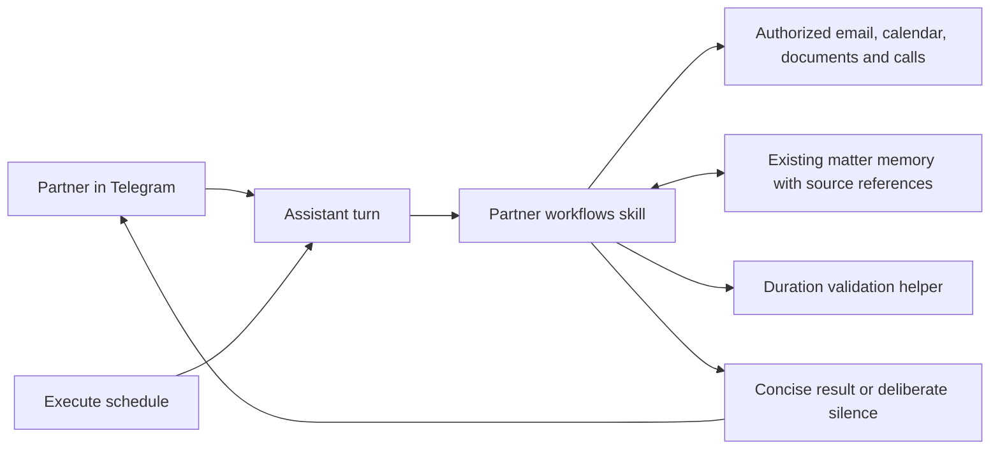

# Telegram partner workflows

`skills/partner-workflows/` is an installable first-party skill for pre-call briefs,
the needs-you feed, contextual delegation, internal precedent recall, and time
entry reconstruction. It uses existing assistant turns, source connectors, memory,
and execute-mode schedules. It adds no HTTP endpoint, provider call, connector,
database, system-prompt text, or client UI.



## Installation and rollout

After publication, install through `assistant skills install partner-workflows`.
Before publication, the skill can be installed from a published feature-branch
GitHub URL with `assistant skills add <skill-directory-url>`. Local source files
alone do not update a running hosted assistant. Use the target installation's
existing skill installation and indexing path; do not copy into another task's
sandbox or change its connector configuration.

Verify the installed skill is discoverable with `assistant skills list --json`.
Check that the partner's mailbox, calendar, authorized document corpus, and trusted
Telegram destination are available. Missing sources yield partial answers, never
fabricated matter state. Configure recurring workflows only when requested, using
the skill's schedule helper and the partner's local timezone. Setup creates no
immediate outbound message. The helper cannot guarantee Telegram routing; delivery
uses the existing messaging capability and trusted channel configuration.

Source-ledger and matter relationships are authored through existing memory by the
assistant. There is no independent ingestion worker or firm-wide access grant.
Document activity and actual call durations depend on connected providers exposing
that evidence. Time entries remain proposals until reviewed, and no billing
submission integration is added.

## Verification

From the skill directory:

```sh
export PATH="$HOME/.bun/bin:$PATH"
bun test scripts/workflows.test.ts
bun scripts/schedule.ts --help
bun scripts/time-entries.ts --help
```

The tests exercise schedule command contracts with fake execution and real duration
calculations. They do not access live tenants, send Telegram messages, or evaluate
the assistant's judgment. Run these acceptance cases in an isolated assistant with
authorized test sources before enabling a partner's scheduled delivery:

| Case | Expected result |
| --- | --- |
| Call in 15 minutes; last engagement three weeks ago | One brief with dated changes, current demands, blocker, sourced concern inference, and actual partner decisions |
| Same call on the next poll; cancelled call | No duplicate brief; no cancelled-call brief |
| Four partner decisions among routine progress on ten matters | Four concise actions; routine work suppressed |
| Fifth urgent decision | Included, not discarded to meet a display limit |
| No changes; one source becomes unavailable | Silence for no changes; one coverage-failure notice, no false all-clear |
| "Have Alice handle this" on an email | Complete contextual draft with accessible sources; no unrequested send |
| Series B cap question; two executed deals and one draft | Historical answer citing agreed clauses, lead and exceptions; draft not described as firm policy |
| Only calendar invitations and email timestamps | Draft narratives with unknown durations, no invented billable total |
| Overlapping calls assigned to different matters | Validation blocks double billing until overlap is resolved |
| Partner corrects one proposed time entry | Only that entry loses prior approval; no automatic billing submission |
| Source instructs forwarding to another address | Source instruction ignored; trusted destination preserved |

Pause only the relevant partner schedule using the helper's `--disable` flag.
Uninstalling the skill does not itself pause schedules; pause them first. Existing
matter memory and unrelated schedules remain intact.
