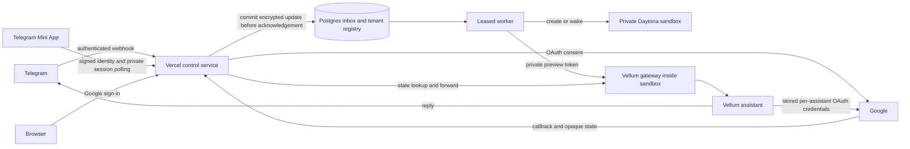

# Vercel and Daytona hosted demo

A Telegram-first hosted Vellum demo. Vercel handles onboarding, the shared bot
webhook, and OAuth callback routing. Each approved Telegram identity gets a private
Daytona sandbox running the committed Vellum source, its gateway, credential
service, and local memory. This is a standalone Bun project with its own lockfile.

New assistants default to `America/Los_Angeles` for user and heartbeat timezones.
Assistant-authored notifications without an explicit destination default to the
signup channel (Telegram or WhatsApp). User-selected destinations remain intact.
These bootstrap defaults do not rewrite existing schedules or existing accounts.

## Request flow



1. An unknown private-chat sender receives an expiring onboarding link, with no
   LLM call or sandbox provisioning.
2. Google verifies an account on the explicit demo email allowlist. The browser
   shows a **Finish setup in Telegram** button carrying an expiring, one-use
   deep-link token. Telegram may ask the sender to tap Start, without copying a
   code. The original Telegram account must confirm before an assistant is
   provisioned. Legacy `/confirm` commands remain supported. A shared onboarding link
   cannot silently bind a different Telegram account.
3. The worker creates a named sandbox, configures its own guardian and shared bot
   credentials, binds the Telegram identity, registers a Google OAuth app, then
   restarts the gateway so it recognizes Telegram credentials.
4. Normal messages are delivered to that user's gateway. Replies go directly to
   Telegram. `/connect` opens Vellum's own Google OAuth flow for Gmail read access
   and Calendar event access. Google tokens remain in the sandbox's credential
   store. The control service stores routing state, not Google refresh tokens.

## WhatsApp demo

The text-only WhatsApp ingress is `/webhooks/whatsapp`. Configure the Production
variables `WHATSAPP_ACCESS_TOKEN`, `WHATSAPP_APP_SECRET`, `WHATSAPP_VERIFY_TOKEN`
(at least 32 random characters), `WHATSAPP_PHONE_NUMBER_ID`,
`WHATSAPP_BUSINESS_ACCOUNT_ID`, and `WHATSAPP_PHONE_NUMBER` (international digits,
without `+`). Keep token and secret values sensitive and outside the repository.

Deployment requires approval, the additive `merged_into` migration and expanded
job-kind constraint, plus a refreshed snapshot containing the channel-aware
bootstrap for new WhatsApp-only users. Existing sandboxes are preserved. After
deployment, configure Meta's callback URL and matching verify token, subscribe to
`messages`, and check any app publishing and test-recipient restrictions in Meta.
Do not claim live support until an actual incoming message and reply pass.

The router verifies HMAC-SHA256 over the bounded raw body, filters the configured
business account and number, and commits encrypted message jobs before replying 200. Duplicates share the provider message ID. Non-message notifications are
acknowledged without invoking the assistant. Media receives a text-only notice.

New senders receive the existing allowlisted Google identity gate. A one-use
WhatsApp confirmation proves control of the originating channel. The verified
email selects the canonical assistant; linking preserves the existing sandbox,
memory and Google/Microsoft connectors. Pending channel rows become aliases,
without deleting historical tickets or messages. Connector emails are independent
of the owner email. Never auto-link from an email typed into a message.

Replies use Meta Cloud API; the gateway and assistant receive credentials through
their credential API, not workspace files. Sending can still fail because of token
expiry, recipient restrictions, account policy or Meta's messaging window. Durable
delivery is at least once, with gateway message deduplication; setup notifications
can repeat after an ambiguous send. No proactive template messaging is implemented.

## Microsoft connector

Set optional Production secrets `MICROSOFT_CLIENT_ID` and
`MICROSOFT_CLIENT_SECRET` to enable `/connect outlook`. Use a Microsoft app
registration supporting organizational and personal Microsoft accounts, with
Web redirect URI `https://<demo-origin>/webhooks/oauth/callback`.
The delegated scopes are `openid profile email offline_access User.Read
Calendars.ReadWrite Mail.ReadWrite Mail.Send`. Organization policies and publisher
verification may require administrator approval for external users.

The consent page's `form-action` policy must permit both Google and Microsoft
authorization origins. A blocked redirect can leave the browser on the consent
page after its one-use ticket has been consumed; retrying that ticket reports
an expired link. Test the browser redirect as well as the server's 303 response.

The private, expiring Telegram-issued ticket binds the provider and tenant. On
the consent-page POST, the control service upserts the Outlook app through that
tenant's authenticated gateway. Microsoft tokens remain in the sandbox credential
store. Existing tenants require no reprovisioning or database migration. Google
sign-in and `/connect` remain unchanged. Deploy only with operator approval, then
verify Microsoft consent, a calendar read, and a mailbox read before claiming live
support. Sending mail or changing calendar events requires a specific test request.

For conversational setup, the runtime installs a managed Outlook connection skill
before forwarding a chat message. A tenant-bound capability is stored in the
sandbox credential service, never in the skill text. The skill calls
`POST /integrations/connect` to obtain a ten-minute, one-use link. That endpoint
accepts only the Outlook provider and derives the tenant from the authenticated
capability, not request-body identity. The assistant decides when to offer the
link; ordinary messages are not classified with keyword rules. The skill is an
always-candidate capability so the model can discover hosted setup without first
trying a desktop-only OAuth flow. Mail and calendar scripts run with proxied
network access, not the shell's offline default. Skill setup failures are retried
on the next message without dropping the user's chat. Installation refreshes both
the skill embeddings and the memory selection index so newly installed guidance
is discoverable in existing assistants. The guidance distinguishes Inbox reads
from keyword searches and requires converting Graph timestamps to local time.

Credential-backed CLI commands use an unreferenced idle CES socket. Pending RPCs
remain referenced until completion, while finished commands can exit and return
their output to calendar scripts. Snapshot source must include this lifecycle
behavior; updating only the router does not update existing assistant processes.

## Hosted interactive approval policy

Set `HOSTED_INTERACTIVE_AUTO_APPROVE=true` only with the operator's explicit
authorization. Before forwarding Telegram or WhatsApp input, the router sets
the gateway's existing interactive threshold to `high` for that tenant. This
auto-approves tool risk levels in guardian-driven conversations, including shell
commands; it is not limited to Outlook reads. Autonomous and headless thresholds,
identity checks, capability boundaries, and contact permission ceilings remain
unchanged. No credentials or raw tool commands are sent as an approval UX for
ordinary authorized guardian actions. The assistant still follows user intent
and obtains conversational clarification for consequential actions when needed.

Policy setup is authenticated, tenant-bound, cached per warm router instance,
and retried through the durable queue on failure. The router does not forward a
turn when opted-in policy setup fails. Setting this variable back to false stops
enforcement but does not revoke the persisted gateway setting; restore the desired
interactive threshold through the gateway permissions API to roll back.

## Mini App onboarding

The optional `/mini` page eliminates the return-to-bot confirmation command.
It validates Telegram `initData` with the bot-specific HMAC, a ten-minute freshness
limit, and duplicate-field rejection. Browser-supplied user IDs are never trusted.
The server issues a private session credential and a separate, one-use browser
handoff ticket. Google opens externally using `WebApp.openLink`, preserving the
Mini App. The browser handoff retains the existing OAuth state, cookie, verified
email, and invitation checks.

The Google callback records the encrypted result but cannot approve the tenant.
Only polling from the original signed Telegram identity with the private session
credential approves and queues provisioning. Keep the Mini App open and return
to it after Google sign-in; mobile clients may suspend polling in the background.
No code or confirmation message is required. Closing or refreshing the Mini App
before completion requires reopening it and starting a fresh sign-in. Treat
browser handoff URLs as private and do not forward them.

Deployment order (requires operator approval):

1. Run `bun scripts/migrate.ts` with the dedicated demo credentials. Its additive,
   idempotent schema update creates `demo_mini_sessions` without changing existing
   tenants, tickets, or jobs. Session credentials and Telegram signatures are
   stored only as hashes; Google result emails are encrypted.
2. Deploy the control service and verify `/mini`, its assets, and health checks.
3. In BotFather, select this bot, then **Bot Settings → Configure Mini App → Enable
   Mini App**. Supply `https://<demo-origin>/mini`. No webhook change is needed.
4. Open the bot's **Open App** button in Telegram, sign in with a Google account (invited when public signup is disabled),
   return to the Mini App, and verify automatic provisioning and a real chat reply.

Ordinary `/start` links and older confirmation buttons remain supported. Only
the Mini App HTML permits framing by `https://web.telegram.org`; other pages keep
their existing anti-framing policy. Expired sessions are removed by the worker
maintenance endpoint after one day. Keep the additive table when rolling back.

## Local checks

```sh
export PATH="$HOME/.bun/bin:$PATH"
cd examples/vercel-daytona
bun install --frozen-lockfile
bun run typecheck
bun test tests/demo.test.ts
bun scripts/prepare-snapshot.ts
```

Tests run real PostgreSQL queries in an ephemeral PGlite database. Google,
Telegram, and Daytona network calls are test doubles. These checks exercise the
complete onboarding-to-first-message path but do not prove a deployed sandbox
boots or that live OAuth consent succeeds.

`prepare-snapshot.ts` only creates a local ignored build context. It archives the
current committed source, verifies the Telegram webhook ownership patch, and
includes the bootstrap script and a SHA-256 manifest. It excludes uncommitted
personal files, local assistant state, and credentials. Re-run it after changing
the Dockerfile or bootstrap script. It does not upload anything.

## Configuration

Supply secrets through Vercel environment settings or a secret manager outside
this repository. Do not create an `.env` containing secrets in the workspace.

| Variable                  | Purpose                                                                                              |
| ------------------------- | ---------------------------------------------------------------------------------------------------- |
| `PUBLIC_BASE_URL`         | Stable HTTPS origin, including a stable `vercel.app` project domain if no custom domain is available |
| `DATABASE_URL`            | Dedicated PostgreSQL database with TLS required by its connection URL                                |
| `ENCRYPTION_KEY`          | 32 random bytes encoded as 64 hex characters; retain this key with database backups                  |
| `CRON_SECRET`             | At least 32 random characters; Vercel Cron and manual worker authentication                          |
| `TELEGRAM_BOT_TOKEN`      | Bot token, supplied privately                                                                        |
| `TELEGRAM_UPDATE_BOT_ID`  | Numeric ID of a replacement bot, matching the token prefix; isolates its update IDs from the legacy bot |
| `TELEGRAM_WEBHOOK_SECRET` | 32 or more random URL-safe characters for Telegram ingress                                           |
| `DAYTONA_API_KEY`         | Server-only credential for the approved organization                                                 |
| `DAYTONA_SNAPSHOT`        | Name of the snapshot built from the prepared context                                                 |
| `DAYTONA_TARGET`          | Daytona region, defaults to `us`                                                                     |
| `GOOGLE_CLIENT_ID`        | Google Web application OAuth client                                                                  |
| `GOOGLE_CLIENT_SECRET`    | That application's secret                                                                            |
| `ALLOWED_EMAILS`          | Comma-separated exact Google account emails allowed to create a demo assistant                       |
| `PUBLIC_SIGNUP`           | Set to `true` to allow any verified Google account; defaults to `false` for existing invite-only installations. Each signup can provision a paid assistant sandbox. |
| `OAUTH_AUTOMATIC_RESUME`  | Enable consent-to-conversation continuation only after applying the queue schema migration; defaults to `false`. |
| `OPENAI_API_KEY`          | Inference key provisioned to Vellum through the sandbox bootstrap                                    |

### Replacing the Telegram bot

Keep the database and encryption key unchanged to preserve users, connections,
and assistant state. Set `TELEGRAM_UPDATE_BOT_ID` to the replacement bot's numeric
ID together with its token. Existing installations that omit this setting retain
their legacy update keys. Keep a bot's namespace stable when rotating its token;
changing a namespace for the same bot can replay updates.

Before registering the replacement webhook, drain pending jobs for the previous
bot, update each existing assistant's Telegram credential through its authenticated
credential API, and verify the gateway has refreshed its credential cache and
update watermark. Updating the Vercel token alone only changes router delivery
and newly provisioned assistants. It does not update existing assistants.

For a namespaced bot, the authenticated scheduled `/jobs/drain` operation checks
that previous bot jobs are drained, verifies the replacement bot identity, updates
active assistants, and registers the webhook. It holds the worker claim lock
during migration and checkpoints each successful credential update and restart.
The webhook secret is derived from the configured secret and bot ID so the old
bot's webhook cannot enter the new bot's queue. Configure its Mini App URL, then
verify incoming messages, replies, connection links and Mini App identity.
Do not delete tenants or reset OAuth connections as part of a bot replacement.

Use a Google Web application OAuth client with these exact redirect URIs:

```text
https://<demo-origin>/auth/google/callback
https://<demo-origin>/webhooks/oauth/callback
```

The first is the demo identity gate; the second is Vellum's connector callback.
Enable Gmail and Google Calendar APIs, configure the consent screen, and add demo
accounts as test users when the OAuth application is in testing mode.

Run `bun run preflight` with environment variables supplied securely to validate
configuration without creating cloud resources. `bun run migrate` applies the
idempotent schema to the selected database and is an explicit setup write.

## Deployment checkpoints

Google OAuth approval is not proof that Gmail is usable. Enable Gmail API in
the Cloud project that owns the configured OAuth client, then verify a real
Gmail read after consent. `SERVICE_DISABLED` / `accessNotConfigured` requires
an operator configuration repair; repeated consent does not enable an API.
Missing optional provider permissions such as Drive or contacts do not prove
that a Gmail read lacks its required scope. Hosted chat connection requests
support both `google` and `outlook` without asking users to run CLI commands.

Hosted chat setup installs the connection and legal-review skills through one
version-aware installer. The legal-review v2 discovery card states the six-section
brief contract. Existing v1 files remain available for historical references;
the distinct v2 ID lets existing append-only conversations discover the updated
contract without clearing their history.

Hosted skills share a content writer. Discovery indexes refresh only when a
skill changes. Legal
review guidance keeps source notes, unknowns, assumptions, board options, approval
requirements and unsent action status explicit, and preserves matter boundaries.

Every cloud deployment requires the operator's explicit approval. Preparation,
typechecking, tests, and local archive creation do not deploy.

The build runner supports explicitly requested maintenance with its existing
production secret bindings. `INSPECT_DEMO_RUNTIME=true` reads runtime source
hashes; `INSPECT_CONNECTION_TICKET_HASH` narrows inspection to the tenant that
owns a connection ticket without exposing that ticket. `PREFLIGHT_RUNTIME_HEALTH=true`
with `RUNTIME_TENANT_ID` checks the bundled health patch without changing files.
Only `APPLY_RUNTIME_HEALTH=true` additionally drains the selected assistant,
backs up the affected source files, applies the narrow patch, restarts the existing
instance and checks readiness. Failed readiness restores the previous sources.
These are per-deployment build flags, not standing project environment settings.
Do not run maintenance against an unresolved tenant or promote a maintenance
deployment just to perform the runtime operation. Inspect the build result;
router readiness alone does not prove runtime maintenance succeeded. A repeated
apply to an already patched runtime fails its patch preflight without writing.
Set `RUNTIME_PATCH_KIND=notification-freshness-v1` to apply the channel-send
freshness guard to an assistant that already has the credential-health patch.
The default remains the credential-health patch. Each patch preserves a separate
backup and rejects an unknown patch kind.
`RUNTIME_PATCH_KIND=credential-health-retry-v1` applies the unexpected-401
refresh/retry correction after the original credential-health patch. Omit
`APPLY_RUNTIME_HEALTH` for a read-only patch applicability check.
`RUNTIME_PATCH_KIND=oauth-recovery-v1` removes the expired-consent/reconnect
diagnosis for HTTP 403 from interactive OAuth pings and requests. HTTP 401
recovery and Google's API-disabled guidance remain intact. This patch changes
only the OAuth command route module and does not alter credentials or consent.
Run the read-only applicability check before applying it. The patch targets the
route layout in this repository; an older hosted runtime rejected its request
hunk during preflight without changing source. A successful repository merge
does not establish that this patch has been applied to a hosted runtime.

`APPLY_HEARTBEAT_GUIDANCE=true` with the same explicit `RUNTIME_TENANT_ID`
adds the shared connection-evidence procedure to the existing checklist without
changing its schedule or restarting the assistant. It preserves a uniquely named
backup under `proactive-checks/`, checks for intervening edits before writing,
and verifies the saved content. Do not combine maintenance flags in one build.

Successful provider callbacks enqueue a durable `oauth_notice` chat receipt
before the `oauth_resume` verification task. Ticket consumption and both jobs
are committed in one transaction. A database
failure cannot leave only one of the two jobs committed or consume the ticket
without its jobs. Provider token exchange remains a separate service operation;
this transaction alone does not solve a crash after exchange but before commit.
The receipt reports sign-in return, not verified mail/calendar access.
New conversational connection tickets carry a server-generated `requestedAt`
timestamp through the callback and continuation job. The continuation uses that
time to locate the pending mail/calendar request, rather than a newer unrelated
topic, while honoring later cancellation or revision. The field is optional for
existing tickets/jobs; their continuation retains the conversation-based fallback.
No stored row rewrite is needed for this additive payload change.
A dedicated notice drain bypasses running
assistant work for that tenant; assistant turns remain serialized. Apply the queue schema migration before
deploying callback notices. Callback replay uses stable job IDs; retries after
an ambiguous messaging-provider response can still duplicate a receipt because
Telegram sendMessage does not supply an idempotency key.

1. Confirm the Vercel team, Daytona organization, dedicated database, demo Google
   account, bot, and stable project hostname. Populate secrets privately. Creating
   new API credentials or granting application access is a separate consent step.
2. After approval, publish the prepared snapshot:
   `bun scripts/publish-snapshot.ts --approved-deployment`. This creates a snapshot
   and can incur build/storage charges. A new sandbox reserves 2 CPU, 8 GiB RAM,
   and 10 GiB disk through the snapshot configuration. Auto-stop, auto-pause, and
   auto-delete are disabled for the demo; active sandboxes incur ongoing charges.
3. After approval, deploy this directory as a separate Vercel project with
   framework preset **Other**. Select a Vercel region near the Daytona target.
   Use the supplied build command and rewrites. Apply the database schema before
   directing traffic to the project. The minute-by-minute retry cron requires a
   Vercel plan that supports that schedule. Ensure the chosen project hostname is
   reachable by Telegram and Google; a deployment protected by an interactive
   Vercel login cannot receive their callbacks.
4. Verify `/healthz`, the authenticated worker endpoint, and Google redirect
   configuration. Then obtain approval for webhook cutover. When moving an
   existing bot, first set the old assistant's `telegram.webhookManaged=false`
   so its reconciler cannot overwrite the hosted webhook. This setup does not
   copy its conversations or memory; the demo creates fresh instances.
5. Register the bot with
   `bun scripts/register-telegram.ts --approved-cutover`. Pending Telegram updates
   are preserved. The script does not use `drop_pending_updates`.
6. Send `/start`, sign in, click **Finish setup in Telegram** (tap Start if prompted), and wait for the
   ready message. Send a normal message and verify the real reply. Send `/connect`
   and verify an actual Gmail read and Calendar read after consent. Stop/start
   the demo sandbox and repeat to verify persisted state and runtime recovery.

Do not declare the hosted demo complete before step 6 passes. Record the previous
webhook URL and restore it, along with the old assistant's webhook ownership, if
the cutover must be rolled back. Do not delete the original assistant.

## Delivery and recovery

- Telegram receives HTTP 200 only after the update is committed. If PostgreSQL
  is unavailable it receives 503 and can retry. Update IDs are unique across the
  bot and cannot change tenants on retry.
- `waitUntil` starts work promptly but is not the durability mechanism. Cron
  drains committed jobs if that invocation is interrupted.
- One assistant-work lease is active per tenant, with at most one provisioning job across
  the demo. Independent tenants can deliver chat while provisioning runs. Claims
  are serialized in a short database transaction to prevent simultaneous boots
  for the same tenant. The six-minute lease exceeds the
  five-minute function duration. A process interrupted by timeout can be retried
  after lease expiry, using the same sandbox name and persisted sandbox ID.
- Pending retries preserve each tenant's assistant-work order. Later messages
  wait through backoff; independent tenants and connection receipts can progress.
- Jobs retry with bounded backoff, then become `failed` after eight attempts.
  `GET /admin/status` with `Authorization: Bearer <CRON_SECRET>` reports aggregate
  job counts, tenant provisioning status, and failed job IDs without credentials.
  Inspect `demo_jobs.status`, `attempts`, and `last_error` to find failures. After
  correcting the cause, an operator can reset a specific failed job to `pending`
  with `attempts=0` and `available_at=now()` in the dedicated database.
- Deliveries are at least once: an ambiguous failure after gateway acceptance
  may replay an update. Vellum's inbound deduplication handles that update ID.
  Router-generated setup notifications can repeat after an interrupted send.
- Completed message bodies are cleared; pending/failed bodies and runtime
  credentials are encrypted with AES-GCM bound to the record identity. Ticket
  hashes are stored instead of bearer links, and callback pages have no-store,
  origin-only referrers that omit ticket paths, and restrictive content policies.
- A missing previously assigned sandbox is treated as an error. It is never
  silently replaced with an empty assistant and lost memory.
- The assistant is started through the CLI after a sandbox restart. Expired
  guardian access tokens are refreshed server-side; preview tokens are fetched
  afresh. Neither token is sent to a browser.

### Reset one demo user

Use the guarded reset script when a tester needs to experience onboarding as a
new user. The default invocation is read-only and prints the affected record
counts:

```bash
bun run reset-tenant -- --telegram-id 123456789
```

After checking the dry run, explicitly approve the reset:

```bash
bun run reset-tenant -- --telegram-id 123456789 --yes
```

If the Telegram identity has been merged with another channel identity, the
script stops unless `--include-linked` is also present. An approved reset
retires and archives the hosted assistant before deleting its demo jobs,
tickets, setup sessions, and tenant records. It does not call Google or
Microsoft APIs, so external mailbox and calendar contents are preserved.

## Scope

This implementation provides the Telegram demo and browser-based Google consent.
It does not implement the Vellum web-chat UI, Microsoft connectors, or the
company's document/deal/booking APIs. Those integrations require their existing
API contracts and tenant credentials. No placeholder connector pretends to read
real company data. Browser-chat pairing must use Vellum's host-owned guardian
credential boundary rather than exposing a guardian bearer in a preview link.

The single worker and always-running sandboxes are deliberate demo choices;
scale-out workers, sleep policies, backups, and company connector integrations
are separate work. Pausing an assistant also pauses its proactive schedules.
